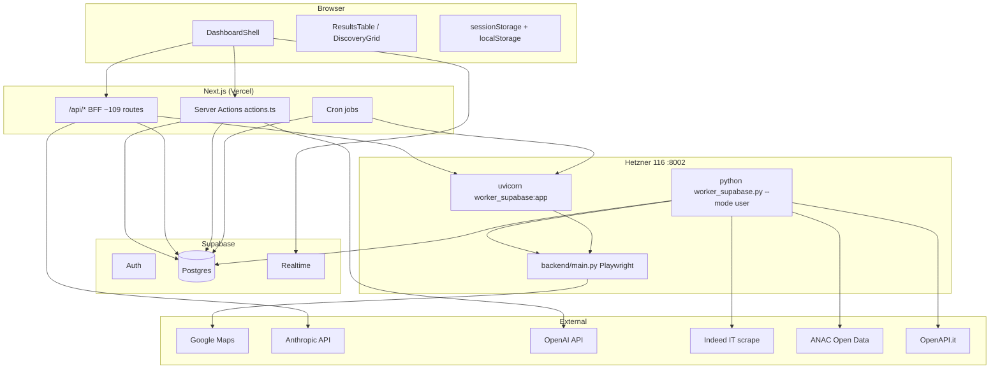
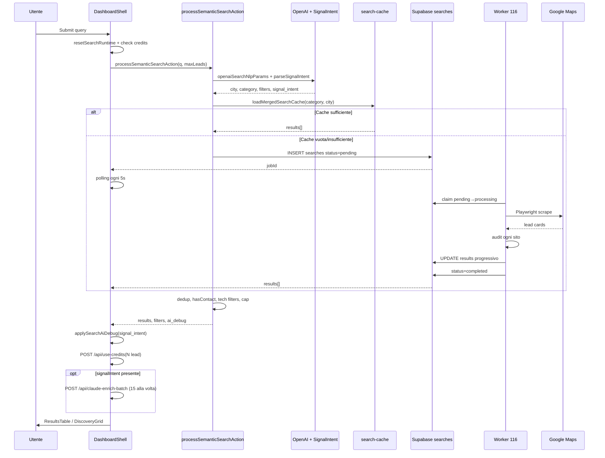

# MIRAX — Architettura Tecnica Completa (A → Z)

**Versione documento:** 2026-06-29  
**Repo:** `pallii5811/ecosistema-mirax`  
**Cartella locale:** `WEB APP CKB - Dev`  
**Deploy app:** Vercel → `ecosistema-mirax.vercel.app`  
**Worker staging:** Hetzner `116.203.137.39:8002`  
**Supabase dev:** `ktspchugdwpqvxhmysap` (EU West)

> Documento di riferimento tecnico per sviluppatori, agenti AI e audit.  
> **Documento canonico aggiornato (linguaggio chiaro + inventario completo):** `docs/MIRAX_ECOSISTEMA_COMPLETO_AZ.md`  
> **Inventario 646 file:** `docs/MIRAX_FILE_INVENTORY.txt`

**Documenti correlati:**
- `docs/MIRAX_ECOSISTEMA_COMPLETO_AZ.md` — **A→Z completo 2026-06-29** (ricerca unificata, Universe, ogni componente)
- `docs/CURSOR_IMPLEMENTATION_BRIEF_MIRAX_V1.md` — brief implementazione fasi
- `ECOSISTEMA_ROADMAP.md` — roadmap blocchi 0–10
- `docs/SCORE_AI_RULES.md` — regole scoring (no ML oggi)
- `docs/BLOCCO0_SETUP.md` — setup staging

---

## Indice

1. [Visione e posizionamento](#1-visione-e-posizionamento)
2. [Matrice ambienti Dev vs Produzione](#2-matrice-ambienti-dev-vs-produzione)
3. [Stack tecnologico](#3-stack-tecnologico)
4. [Topologia runtime](#4-topologia-runtime)
5. [Struttura repository](#5-struttura-repository)
6. [Database Supabase](#6-database-supabase)
7. [Autenticazione e sicurezza](#7-autenticazione-e-sicurezza)
8. [Frontend — pagine e routing](#8-frontend--pagine-e-routing)
9. [Componenti core UI](#9-componenti-core-ui)
10. [DashboardShell — orchestratore centrale](#10-dashboardshell--orchestratore-centrale)
11. [Modalità UI: Expert vs Discovery](#11-modalità-ui-expert-vs-discovery)
12. [Flusso ricerca Maps (end-to-end)](#12-flusso-ricerca-maps-end-to-end)
13. [Server Actions e NLP (`actions.ts`)](#13-server-actions-e-nlp-actionsts)
14. [Cache ricerche e job incrementali](#14-cache-ricerche-e-job-incrementali)
15. [Polling, sessionStorage, persistenza client](#15-polling-sessionstorage-persistenza-client)
16. [Sistema crediti e billing](#16-sistema-crediti-e-billing)
17. [MIRAX Omnivoro — Signal Intent](#17-mirax-omnivoro--signal-intent)
18. [Claude Intent Enrichment](#18-claude-intent-enrichment)
19. [Mirax Signals e Business Events](#19-mirax-signals-e-business-events)
20. [Scoring: Opportunity, Intent, Buying](#20-scoring-opportunity-intent-buying)
21. [Filtri lead e visualizzazione risultati](#21-filtri-lead-e-visualizzazione-risultati)
22. [Worker Python — architettura](#22-worker-python--architettura)
23. [Pipeline Maps scrape (`main.py`)](#23-pipeline-maps-scrape-mainpy)
24. [Audit engine](#24-audit-engine)
25. [Business Events Enrichment](#25-business-events-enrichment)
26. [Waterfall Enrichment](#26-waterfall-enrichment)
27. [Organic discovery](#27-organic-discovery)
28. [Competitive intelligence](#28-competitive-intelligence)
29. [Realtime signals (Supabase Realtime)](#29-realtime-signals-supabase-realtime)
30. [Lead detail e provider enrichment](#30-lead-detail-e-provider-enrichment)
31. [Outreach, sequences, outbound queue](#31-outreach-sequences-outbound-queue)
32. [CRM / NOUS](#32-crm--nous)
33. [Pipeline kanban](#33-pipeline-kanban)
34. [Insights, knowledge, EDAT](#34-insights-knowledge-edat)
35. [Research Agent](#35-research-agent)
36. [Compliance GDPR](#36-compliance-gdpr)
37. [Multi-agent system](#37-multi-agent-system)
38. [Catalogo API routes (~109)](#38-catalogo-api-routes-109)
39. [Cron jobs Vercel](#39-cron-jobs-vercel)
40. [Variabili d'ambiente](#40-variabili-dambiente)
41. [Testing e deploy](#41-testing-e-deploy)
42. [Roadmap e stato implementazione](#42-roadmap-e-stato-implementazione)
43. [Problematiche, criticità, debito tecnico](#43-problematiche-criticità-debito-tecnico)
44. [Glossario](#44-glossario)
45. [Ricerca unificata Discovery / Grafo / Ibrido](#45-ricerca-unificata-discovery--grafo--ibrido)
46. [Knowledge Graph Universe — stato 2026-06](#46-knowledge-graph-universe--stato-2026-06)
47. [Organic discovery](#47-organic-discovery)
48. [Documentazione canonica A→Z](#48-documentazione-canonica-az)

---

## 1. Visione e posizionamento

### 1.1 Cosa è MIRAX

MIRAX è una piattaforma B2B italiana di **lead generation intelligente** che unisce tre capability in un unico flusso:

| Capability | Descrizione | Implementazione |
|------------|-------------|-----------------|
| **Segnale** | Hiring, gare, funding, ads, cambi registro, CRM stack | `business-events/`, worker, waterfall |
| **Audit** | Pixel, GTM, SSL, SEO, mobile, stack tecnologico | `audit_engine.py`, `buyingSignals.ts` |
| **Azione** | Pitch AI, outreach, pipeline, CRM sync, sequences | outreach, NOUS, pipeline |

### 1.2 MIRAX “Omnivoro”

Per **omnivoro** si intende la capacità di accettare **qualsiasi richiesta in linguaggio naturale** e:

1. **Interpretarla** → `parseSignalIntent()` (Claude/OpenAI/heuristic)
2. **Tradurla in categoria Maps + città + filtri** → `inferMapsCategoryFromIntent()`
3. **Recuperare aziende da Google Maps** → worker Playwright
4. **Auditare ogni sito** → audit engine
5. **Arricchire con il dato richiesto** → Claude batch (`claude-intent-enrich/`) o worker (Indeed, ANAC, OpenAPI)
6. **Mostrare tutto in tabella** con colonne dedicate (Opportunità = audit; ASSUNZIONI/DATO RICHIESTO = intent Claude)

Esempi di query supportate:
- *"Imprese edili a Taranto"* → lista Maps completa, audit tecnico
- *"Aziende che assumono programmatori Python a Milano"* → Maps IT + colonna hiring Claude/Indeed
- *"Software house senza pixel a Roma"* → filtri tecnici NLP + audit
- *"Startup che hanno vinto gare in Emilia"* → tender_won + ANAC waterfall

### 1.3 Principi non negoziabili (HITL)

- **Mai inventare** email/telefono — solo dati da Maps, sito, fonti pubbliche
- **Human-in-the-loop** su outreach email/WhatsApp — nessun invio autonomo
- **GDPR EU** — server EU, fonti pubbliche, legittimo interesse documentato
- **Crediti** — ogni lead visualizzato consuma credito utente

---

## 2. Matrice ambienti Dev vs Produzione

| Dimensione | **Dev / Ecosistema** | **Produzione (legacy)** |
|------------|----------------------|-------------------------|
| Cartella locale | `WEB APP CKB - Dev` | `WEB APP CKB - Copia` |
| GitHub | `ecosistema-mirax` | `miraxgroupckb` |
| Deploy frontend | Vercel preview `ecosistema-mirax.vercel.app` | Vercel `miraxgroup.it` |
| Supabase | `ktspchugdwpqvxhmysap` | progetto produzione |
| Worker/API | Hetzner **116:8002** | Hetzner **178:8001** |
| Default `BACKEND_URL` | `http://116.203.137.39:8002` | produzione |
| Regola operativa | Sviluppo e test **solo qui** | Intoccabile salvo hotfix |

---

## 3. Stack tecnologico

| Layer | Tecnologia | Versione / note |
|-------|------------|-----------------|
| Frontend | Next.js App Router | 16.1.6 |
| UI | React, Tailwind 4, Radix, shadcn | React 19 |
| Linguaggio | TypeScript | 5.x strict |
| Auth + DB | Supabase (Postgres, Auth, Realtime) | EU West |
| AI NLP | OpenAI GPT-4o-mini | parsing query → filtri JSON |
| AI Semantic | Anthropic Claude Sonnet | intent parse + enrich |
| Worker | Python 3, FastAPI, Playwright | sync-in-thread |
| Pagamenti | Stripe + PayPal | subscription + one-shot |
| Email | Resend | sequences, welcome |
| Deploy frontend | Vercel | cron, serverless API |
| Deploy worker | Hetzner VPS + systemd | 2 processi: API + poller |

---

## 4. Topologia runtime



### 4.1 Due processi worker su Hetzner

| Unit systemd | Comando | Ruolo |
|--------------|---------|-------|
| `mirax-audit-api-staging` | `uvicorn worker_supabase:app --host 0.0.0.0 --port 8002` | HTTP API on-demand (audit-url, enrich-hiring, competitor) |
| `mirax-worker-staging` | `python worker_supabase.py --mode user --cooldown 5` | Poll job `searches` pending → scrape + audit + enrich |

---

## 5. Struttura repository

```
WEB APP CKB - Dev/
├── src/
│   ├── app/                    # Next.js App Router (pagine + API)
│   │   ├── dashboard/          # Dashboard pages + actions.ts (~5687 righe)
│   │   └── api/                # ~109 route handlers
│   ├── components/             # UI React (DashboardShell, ResultsTable, …)
│   ├── lib/                    # Business logic TypeScript
│   └── utils/                  # Supabase clients, buyingSignals
├── backend_mirror/             # Worker Python
│   ├── worker_supabase.py      # Poller + FastAPI (~3420 righe)
│   ├── main.py                 # Playwright Maps scraper (~2468 righe)
│   ├── audit_engine.py         # Audit tecnico siti
│   ├── business_events_enrich.py
│   ├── waterfall_enrich.py
│   ├── competitor_track.py
│   ├── signal_intent_filters.py  # Stub — non wired
│   └── scripts/deploy-staging.*
├── db/
│   ├── bootstrap/              # generated_schema.sql, RLS
│   └── migrations/             # 22 migration SQL
├── scripts/                    # Test E2E, db apply, deploy
└── docs/                       # Documentazione
```

---

## 6. Database Supabase

### 6.1 Schema bootstrap (`db/bootstrap/generated_schema.sql`)

| Tabella | Scopo | Campi chiave |
|---------|-------|--------------|
| `profiles` | Utente | `credits`, `plan_type`, `stripe_*`, `paypal_*` |
| `searches` | Job scrape | `category`, `location`, `status`, `results` JSONB, `zone`, `user_id` |
| `leads` | Lead normalizzati | dati azienda, contatti |
| `lead_enrichments` | Cache enrichment | per lead/sorgente |
| `lists`, `list_leads`, `saved_leads` | Liste utente | |
| `environments` | Raggruppamento semantico “ambiente” | |
| `lead_pipeline` | Kanban CRM interno | stage, note |
| `outreach_log` | Storico outreach | |
| `sequences`, `sequence_runs`, `scheduled_emails` | Email sequences | |
| `user_scoring_models` | Pesi scoring adattivo | |
| `user_integrations` | Webhook URL | |
| `lead_interactions` | Feedback scoring | |

### 6.2 Tabelle aggiunte via migration

| Migration | Tabella / modifica |
|-----------|-------------------|
| `2026_06_23_searches_zone` | Colonna `zone` su `searches` (cap max lead) |
| `2026_06_25_edat_events` | `mirax_events`, `lead_monitors`, `lead_alerts` |
| `2026_06_27_knowledge_objects` | Knowledge base + pgvector |
| `2026_07_01_lead_business_signals` | Segnali business per lead |
| `2026_07_01_compliance_checks` | Check GDPR/opposizioni |
| `2026_12_01_signal_quality` | `website_snapshots` |
| `2026_12_02_research_cache` | Cache research agent 24h |
| `2026_12_04_realtime_business_signals` | Realtime publication |
| `2026_12_05_outbound_queue` | Coda approvazione HITL |
| `2026_12_06_competitors` | `competitors`, `competitor_alerts` |
| `2026_12_07_crm_auto_sync` | `crm_integrations`, sync log |

### 6.3 Tabella `searches` — lifecycle job

```
pending → processing → completed | error
```

- **`results`**: array JSONB di lead (forma italiana: `azienda`, `sito`, `telefono`, `citta`, `categoria` + alias EN)
- **`zone`**: overload — zona geografica O cap numerico max risultati
- Worker aggiorna `results` **progressivamente** durante `processing`

### 6.4 Tabella `lead_business_signals`

- Segnali business persistiti per utente/lead
- Unique: `(user_id, lead_website, signal_type, title)`
- Realtime abilitato → frontend riceve INSERT via Supabase channel
- RLS: utente vede solo i propri; service role full access

### 6.5 Apply schema

```bash
npm run setup:ecosistema    # bootstrap + RLS + migrations
npm run db:apply-mirax      # solo migrations MIRAX
npm run db:apply-dev        # apply dev database
```

---

## 7. Autenticazione e sicurezza

### 7.1 Middleware (`src/middleware.ts`)

- Matcher: `/dashboard/*`, `/login`
- Supabase SSR cookie bridge
- Non autenticato → redirect `/login`
- Autenticato su `/login` → redirect `/dashboard`

### 7.2 Client Supabase

| File | Uso |
|------|-----|
| `src/utils/supabase/client.ts` | Browser (`createBrowserClient`) |
| `src/utils/supabase/server.ts` | Server Components, Route Handlers |
| `createServiceRoleClient()` | Bypass RLS — solo server-side |

### 7.3 Auth flows

| Flow | Path / azione |
|------|---------------|
| Signup | `supabase.auth.signUp` → email `/auth/confirm` → welcome email |
| Login | `signInWithPassword` → clear sessionStorage → `/dashboard` |
| Reset password | `/auth/reset-password`, `/auth/update-password` |
| Profile auto-create | `dashboard/layout.tsx` upsert `profiles` con 10 crediti free |

### 7.4 Altri meccanismi auth

| Meccanismo | File | Uso |
|------------|------|-----|
| Cron auth | `src/lib/cron-auth.ts` | Bearer `CRON_SECRET` |
| REST API v1 | `src/lib/api-auth.ts` | API keys `mx_*` in tabella `api_keys` |
| Admin | `ADMIN_EMAILS` env | add-credits |

---

## 8. Frontend — pagine e routing

### 8.1 Pagine pubbliche

| Route | File | Scopo |
|-------|------|-------|
| `/` | `src/app/page.tsx` | Landing marketing |
| `/login`, `/signup` | auth pages | Login/registrazione |
| `/terms`, `/privacy`, `/cookie-policy` | legal | |
| `/auth/confirm`, `/auth/reset-password`, `/auth/update-password` | auth | |

### 8.2 Dashboard (principali)

| Route | Scopo |
|-------|-------|
| `/dashboard` | Ricerca principale → `DashboardShell` |
| `/dashboard/leads` | Liste salvate |
| `/dashboard/environments` | Ambienti lead |
| `/dashboard/outreach` | Centro outreach |
| `/dashboard/pipeline` | Kanban pipeline |
| `/dashboard/insights` | Smart Insights |
| `/dashboard/market-map` | Mappa competitiva |
| `/dashboard/sequences` | Sequences email |
| `/dashboard/deliverability` | SPF/DKIM/DMARC |
| `/dashboard/stats` | Hotlist |
| `/dashboard/integrations` | Hub integrazioni |
| `/dashboard/integrations/crm` | CRM connect |
| `/dashboard/compliance` | GDPR / Registro Opposizioni |
| `/dashboard/billing` | Piani Stripe/PayPal |
| `/dashboard/profile` | Account |
| `/dashboard/lead/[searchId]/[leadIndex]` | Dettaglio singolo lead |

### 8.3 Ecosistema (feature-flagged)

Route sotto `/dashboard/ecosistema/*` — nascoste unless `NEXT_PUBLIC_SHOW_CENTRO_COMANDO=1` (`src/lib/feature-flags.ts`).

---

## 9. Componenti core UI

| Componente | Path | Ruolo |
|------------|------|-------|
| **DashboardShell** | `src/components/DashboardShell.tsx` (~2687 righe) | Orchestrazione ricerca, polling, crediti, enrich Claude, realtime |
| **ResultsTable** | `src/components/ResultsTable.tsx` | Tabella Expert: score, opportunità, intent column, pitch, CRM |
| **SniperArea** | `src/components/SniperArea.tsx` | Input ricerca Expert, max leads |
| **DiscoverySearchWizard** | `src/components/discovery/DiscoverySearchWizard.tsx` | Wizard 3 step imprenditori |
| **DiscoveryResultsGrid** | `src/components/discovery/DiscoveryResultsGrid.tsx` | Griglia card Discovery |
| **DiscoveryLeadCard** | `src/components/discovery/DiscoveryLeadCard.tsx` | Card lead semplificata |
| **DashboardLayoutClient** | `src/components/DashboardLayoutClient.tsx` | Sidebar + header |
| **DashboardContext** | `src/components/DashboardContext.tsx` | credits, planType, uiMode, locale |
| **BusinessSignalBadge** | segnali business | |
| **IntentScoreBadge** | score intent 0–100 | |
| **UiModeToggle** | Expert ↔ Discovery | |

---

## 10. DashboardShell — orchestratore centrale

`DashboardShell.tsx` è il **cuore runtime** dell'applicazione. Gestisce:

### 10.1 State principale

| State | Tipo | Scopo |
|-------|------|-------|
| `query` | string | Query ricerca corrente |
| `results` | unknown[] | Lead raw da server/cache |
| `displayResults` | derived | Lead visibili dopo filtri **espliciti** utente |
| `signalIntent` | SignalIntentSpec | Intent parsato (per colonna Claude, NON filtro auto) |
| `businessSignalFilters` | BusinessSignalType[] | Chip filtri business (hiring, registry, …) |
| `minIntentScore` | number | Soglia intent (0 o 60) |
| `isLoading`, `isScraping` | boolean | Stati UI ricerca |
| `scrapeJobId`, `currentSearchId` | string | Job attivo per polling |
| `credits` | number | Crediti utente |
| `maxLeads` | number | Cap lead richiesti (max 500) |
| `uiMode` | expert/discovery | Modalità UI |
| `searchMode` | maps/database/ambiente | Tipo ricerca |

### 10.2 Funzioni chiave

| Funzione | Scopo |
|----------|-------|
| `processSemanticSearch()` | Path primario → `processSemanticSearchAction` |
| `runSearch()` | Fallback → `textToFilterSearchAction` |
| `resetSearchRuntime(q)` | Reset results, job, filtri business, sessionStorage |
| `applySearchAiDebug(debug)` | Imposta `aiDebug` + `signalIntent` da risposta NLP |
| `mergeEnrichedHiringLeads(patch)` | Merge batch Claude/Indeed su results |
| `deductCredits(amount)` | POST `/api/use-credits` |
| `clearBusinessFilters()` | Reset chip business + minIntentScore (NON signalIntent) |
| `leadFilterMeta` useMemo | Filtra solo per filtri **espliciti** utente |

### 10.3 Effetti useEffect critici

1. **Persistenza sessionStorage** — query, results, filters, searchId, scrapeJobId
2. **Auto-scrape** — se results < maxLeads → `/api/trigger-scrape`
3. **Polling job** — Supabase `searches` ogni 5s
4. **Claude enrich batch** — se `signalIntent` presente → POST `/api/claude-enrich-batch` (15 lead)
5. **Realtime signals** — subscribe `lead_business_signals` → patch results + hot lead toast
6. **Resume audits** — se audit pending → `/api/resume-audits`

---

## 11. Modalità UI: Expert vs Discovery

Definite in `src/lib/ui-mode.ts`, persistite in `localStorage: mirax_ui_mode`.

| Aspetto | **Expert** (default) | **Discovery** |
|---------|---------------------|---------------|
| Target | Agenzie, marketer | Imprenditori |
| Input | Testo libero (`SniperArea`) | Wizard 3 step |
| Risultati | `ResultsTable` (tabella completa) | `DiscoveryResultsGrid` (card) |
| Filtri tecnici | Visibili (pixel, SEO, …) | Nascosti/semplificati |
| Backend | Identico — entrambi chiamano `processSemanticSearch()` | |

**Discovery** costruisce la query via `buildDiscoverySearchQuery()` da `src/lib/discovery-intent-map.ts` (intent imprenditoriale → stringa NL).

**Search mode** (ortogonale a UI mode):
- `maps` — ricerca Google Maps (default)
- `database` — Snov/Apollo (`DatabaseSearchSection`)
- `ambiente` — espansione categoria AI (`expandAndSearch`)

---

## 12. Flusso ricerca Maps (end-to-end)



### 12.1 Gate qualità contatti

`_hasContact()` in DashboardShell: lead deve avere **telefono OR email** validi (no domini fake, no placeholder).

### 12.2 Deduplicazione

- Per sito normalizzato
- Phantom phone/email: se stesso numero appare su 3+ lead → stripped

---

## 13. Server Actions e NLP (`actions.ts`)

File: `src/app/dashboard/actions.ts` (~5687 righe, `'use server'`).

### 13.1 Exports principali

| Action | Ruolo |
|--------|-------|
| `textToFilterSearchAction` | **Core** — NL → filtri → cache/scrape → lead |
| `processSemanticSearchAction` | Wrapper con timeout 60s |
| `textToFilterSearchActionExpanded` | Variante expanded (ambiente) |
| `expandAndSearch` | Espansione categoria |
| `analyzeSiteAction` | Audit singolo sito |
| `generatePitchAction` | Pitch email AI |
| `generateWhatsAppPitchAction` | Pitch WhatsApp AI |

### 13.2 Pipeline NLP interna

```
userQuery
  → fetchAvailableSearchOptions()     # città/categorie note in DB
  → openaiSearchNlpParams()           # GPT-4o-mini → JSON strutturato
  → heuristicSearchNlpParams()          # regex override (senza Instagram, disambiguazione)
  → parseSignalIntent(query)            # Claude/OpenAI/heuristic → SignalIntentSpec
  → inferMapsCategoryFromIntent()       # categoria Maps (MAI "Aziende" generico)
  → inferSearchKeywordsFromIntent()     # boost keyword IT/hiring/startup
  → merge filtri LLM + heuristic + semantic
  → loadMergedSearchCache()
  → se vuoto: requestIncrementalScrape() → pending job
  → flatten + filtri tecnici OR + filtri base AND (city, category strict)
  → filterLeadsWithAI()                 # seconda passata rilevanza AI
  → coerceLead() → dedup phantom contacts
  → return { results, filters, ai_debug, status?, jobId?, searchId? }
```

### 13.3 Output `ai_debug`

Contiene:
- `signal_intent` → `SignalIntentSpec`
- `technical_filters` → pixel, SEO, SSL, …
- `nlp_raw` → risposta OpenAI grezza
- `category_resolved`, `city_resolved`

---

## 14. Cache ricerche e job incrementali

Modulo: `src/lib/search-cache.ts`

| Funzione | Scopo |
|----------|-------|
| `loadMergedSearchCache(category, city)` | Merge risultati da job `completed` stessa categoria+città |
| `requestIncrementalScrape(...)` | Insert `searches` pending + trigger worker |
| `formatCanonicalLabel` | Normalizza label categoria |

Modulo: `src/lib/search-job-payload.ts`

- `MAX_LEADS_PER_SEARCH = 500`
- `buildPendingSearchInsert()` — payload insert Supabase
- `clampSearchMaxLeads(max, credits)` — cap per crediti disponibili
- `zone` encoding — cap numerico nel campo `zone`

**Regola cache:** match **strict** su `category` canonica (fix recente — no partial match che mischiava categorie).

---

## 15. Polling, sessionStorage, persistenza client

### 15.1 sessionStorage keys

| Key | Contenuto |
|-----|-----------|
| `ckb_query` | Query attiva |
| `ckb_results` | Array lead serializzato |
| `ckb_filters` | Filtri NLP attivi |
| `ckb_business_signal_filters` | Chip business signal |
| `ckb_min_intent_score` | Soglia intent |
| `ckb_aiDebug` | Payload debug AI |
| `ckb_searchId` | UUID search corrente |
| `ckb_maxLeads` | Cap lead |
| `ckb_scrapeJobId` | Job scrape attivo |
| `ckb_active_lead` | Lead per pagina dettaglio |

**Clear on:** login, `resetSearchRuntime()` (nuova ricerca).

### 15.2 localStorage keys

| Key | Contenuto |
|-----|-----------|
| `mirax_ui_mode` | expert / discovery |
| `mirax_first_run_done` | onboarding completato |
| locale i18n | IT/EN |

### 15.3 Tre meccanismi polling (DashboardShell)

| Meccanismo | Trigger | Intervallo |
|------------|---------|------------|
| `currentJobId` poll | searchState pending | 5s, timeout 10min |
| `scrapeJobId` poll | isScraping | configurabile |
| Auto-scrape loop | results < maxLeads | trigger-scrape + poll |

---

## 16. Sistema crediti e billing

### 16.1 Piani

| Piano | Crediti | Stripe env | Prezzo indicativo |
|-------|---------|------------|-------------------|
| free | 10 | — | €0 |
| starter | 1200 | `STRIPE_PRICE_STARTER` | €49 |
| pro | 3000 | `STRIPE_PRICE_PRO` | €99 |
| agency | 10000 | `STRIPE_PRICE_AGENCY` | €249 |

### 16.2 Flusso crediti ricerca

1. Layout carica `profiles.credits`
2. Pre-check: `credits <= 0` → blocco ricerca
3. Cap: `min(maxLeads, credits, 500)`
4. Post-risultati: `POST /api/use-credits { amount: N }` — update atomico con race guard
5. Budget fisso per sessione: `searchCreditBudgetRef`

### 16.3 Billing routes

| Route | Scopo |
|-------|-------|
| `/api/stripe/checkout` | Checkout subscription |
| `/api/stripe/webhook` | Eventi Stripe → update profiles |
| `/api/stripe/portal` | Customer portal |
| `/api/paypal/create-order`, `/capture-order` | PayPal one-shot |

---

## 17. MIRAX Omnivoro — Signal Intent

Modulo: `src/lib/signal-intent/`

### 17.1 `SignalIntentSpec` (types.ts)

```typescript
{
  required_signals: MiraxSignalRequirement[]  // hiring, tender_won, …
  hiring_roles: string[]
  sector_keywords: string[]
  crm_keywords: string[]
  time_window_days: number
  technical_filters: IntentTechnicalFilters   // no_pixel, seo_errors, …
  social_filters: IntentSocialFilters         // has_instagram, …
  business_filters: IntentBusinessFilters     // revenue_min, employees_min, …
  intent_summary: string
  reasoning: string
  category: string                            // categoria Maps inferita
  parse_source: 'claude' | 'openai' | 'heuristic' | …
}
```

### 17.2 Segnali supportati (`required_signals`)

| Segnale | Significato | Fonte dati |
|---------|-------------|------------|
| `hiring` | Sta assumendo | Indeed, sito careers, Claude |
| `registry_change` | Cambio registro/CCIAA | OpenAPI |
| `sector_investment` | Investimento settore | news, sito |
| `tender_won` | Gara vinta | ANAC, TED |
| `crm_detected` | CRM rilevato | audit sito |
| `crm_change` | Cambio CRM | audit_changes |
| `site_stale` | Sito obsoleto | last_audited_at |
| `meta_ads_started` | Ads Meta attive | audit |
| `google_ads_started` | Google Ads attive | audit |
| `investing_marketing` | Investe in marketing | composite |

### 17.3 Parser chain (`parse-semantic.ts`)

```
parseSignalIntent(query):
  1. callAnthropicSemantic()     # ANTHROPIC_API_KEY, SEMANTIC_MODEL
  2. callOpenAiSemantic()        # fallback ANTHROPIC_API_KEY
  3. semantic-graph-fallback     # grafo regole
  4. parseSignalIntentHeuristic  # regex IT
```

### 17.4 Inferenza categoria Maps (`infer-maps-category.ts`)

**Regola critica:** mai restituire `"Aziende"` generico.

Logica:
1. Pattern regex espliciti (edili, ristoranti, software house, …)
2. Hiring roles → verticale (Python → Servizi informatici)
3. Sector keywords (fotovoltaico → Impianti fotovoltaici)
4. Business signals composite (tender_won + edil → Imprese edili)
5. Fallback: `intent.category` o `null`

### 17.5 Matching lead ↔ intent (`match-lead.ts`)

- `leadMatchesSignalIntent()` — ogni required_signal deve essere soddisfatto
- `filterLeadsBySignalIntent()` — filtra array (usato solo se utente attiva filtro esplicito)
- Hiring match: preferisce `claude_enrichment.matches_request === true`, fallback Indeed

### 17.6 UI cells (`intent-cell.ts`, `hiring-cell.ts`)

- Colonna **ASSUNZIONI** / **DATO RICHIESTO** in ResultsTable
- Viola = match richiesta · Giallo = analisi in corso · Grigio = nessuna evidenza

---

## 18. Claude Intent Enrichment

Modulo: `src/lib/claude-intent-enrich/`

### 18.1 Flusso

```
Per ogni lead senza claude_enrichment:
  1. gatherLeadContext() — homepage, /careers, web search (Serper/Brave)
  2. enrichLeadWithClaude() — Anthropic API
  3. Scrive claude_enrichment: { matches_request, confidence, summary, evidence[] }
```

### 18.2 API

- **Route:** `POST /api/claude-enrich-batch`
- **Auth:** Supabase user required
- **Env:** `ANTHROPIC_API_KEY` obbligatoria
- **Modello:** `CLAUDE_ENRICH_MODEL` || `SEMANTIC_MODEL` || `claude-sonnet-4-20250514`
- **Consigliato Sonnet 4.6:** `CLAUDE_ENRICH_MODEL=claude-sonnet-4-6`

### 18.3 Trigger client

`DashboardShell` useEffect:
- Condizione: `signalIntent` con `required_signals` o `reasoning`
- Batch: 15 lead alla volta, loop finché tutti arricchiti
- **NON filtra** la lista — solo arricchisce colonna dedicata

### 18.4 Prompt enrich (`core.ts`)

Chiede a Claude di verificare se l'azienda soddisfa la richiesta utente usando **solo evidenze** nel contesto. Vietato inventare dati.

---

## 19. Mirax Signals e Business Events

### 19.1 `mirax-signals.ts`

`analyzeMiraxSignals(lead)` unifica:
- `analyzeBuyingSignals()` — segnali tecnici (Pixel, GTM, SEO, SSL, …)
- `collectBusinessEventsFromLead()` — segnali business

Score labels: `freddo` / `interessante` / `caldo` / `caldissimo`

### 19.2 `business-events/` detectors

| File | Segnali |
|------|---------|
| `marketing-intent.ts` | hiring, ads intent |
| `registry-delta.ts` | cambi registro |
| `crm-stack.ts` | CRM rilevato |
| `sector-investment.ts` | investimenti settore |
| `tender-wins.ts` | gare vinte |
| `site-stale.ts` | sito obsoleto |

### 19.3 API business events

- `GET|POST /api/lead/business-events` — read/write `lead_business_signals`
- Worker popola `business_signals[]` e `business_hiring_jobs[]` su results JSONB

### 19.4 Route hiring batch (legacy/worker)

- `POST /api/enrich-hiring-batch` → proxy worker `/enrich-hiring-batch`
- Frontend preferisce Claude batch; worker path per Indeed diretto

---

## 20. Scoring: Opportunity, Intent, Buying

### 20.1 Opportunity Score (0–100)

File: `src/utils/buyingSignals.ts` — `calcOpportunityScore()`

Rule-based (no ML — vedi `docs/SCORE_AI_RULES.md`):
- Penalità: no pixel (-15), no GTM (-10), no SSL (-10), SEO errors (-15), …
- Bonus: stack rilevato, rating Maps

### 20.2 Intent Score (0–100)

File: `src/lib/scoring/intent-score-core.ts`

Basato su segnali business + tecnici composite. Soglia **Hot Lead = 60**.

### 20.3 Buying Signal Score

`analyzeBuyingSignals()` — score commerciale per badge WARM/HOT in tabella.

### 20.4 Adaptive scoring

Tabella `user_scoring_models` — pesi personalizzabili per feedback utente (Blocco 4 roadmap).

---

## 21. Filtri lead e visualizzazione risultati

### 21.1 Regola attuale (post-fix 2026-06-24)

**Default: mostra TUTTI i lead** trovati da Maps/cache.

Filtri applicati **solo se utente li attiva esplicitamente**:

| Filtro | Trigger | Implementazione |
|--------|---------|-----------------|
| Chip business signal | `businessSignalFilters.length > 0` | `filterLeadsByBusinessSignals()` |
| Solo caldi (intent ≥ 60) | `minIntentScore > 0` | `filterLeadsByMinIntentScore()` |
| Solo caldi (buying) | `hotOnly` in ResultsTable | score buying ≥ 60 |
| ~~Auto signal intent~~ | ~~RIMOSSO~~ | non filtra più automaticamente |
| ~~Auto intent spec~~ | ~~RIMOSSO~~ | non filtra più automaticamente |

### 21.2 `displayResults` vs `results`

- `results` = array completo da server
- `displayResults` = dopo filtri espliciti utente
- ResultsTable riceve `displayResults` + `totalUnfilteredCount={results.length}`

### 21.3 Reset filtri

- `resetSearchRuntime()` — azzera businessSignalFilters, minIntentScore, sessionStorage
- `clearBusinessFilters()` — reset chip (mantiene signalIntent per colonna Claude)
- Nuova ricerca → `hotOnly` reset in ResultsTable

---

## 22. Worker Python — architettura

File principale: `backend_mirror/worker_supabase.py` (~3420 righe)

### 22.1 Funzioni core

| Funzione | Ruolo |
|----------|-------|
| `process_single_url(url)` | Audit singolo URL (Playwright + audit_engine) |
| `_run_core_scraper()` | Maps scrape → audit ogni lead |
| `_discover_organic_website_leads()` | SERP discovery (Bing/Brave/Google/DDG) |
| `_format_results()` | Normalizza row Maps → shape frontend |
| `_merge_formatted_results()` | Merge Maps + organic |
| `_finish_pending_audits()` | Completion pass audit light (3 concurrent) |
| `_run_business_events_enrichment()` | Wrapper business_events_enrich |
| `main()` | CLI poller |
| `run_reaudit_worker()` | Re-audit lead stale |

### 22.2 CLI

```bash
python worker_supabase.py --mode user|all|backlog --cooldown 5
python worker_supabase.py --enqueue --cities "Milano" --categories "Software House"
python worker_supabase.py --reaudit --reaudit-max 50
python worker_supabase.py --once
```

### 22.3 HTTP endpoints worker (port 8002)

| Method | Path | Scopo |
|--------|------|-------|
| GET | `/health` | Liveness |
| GET | `/api/v1/health` | Resilience status |
| POST | `/audit-url` | Audit singolo URL |
| POST | `/reaudit` | Background re-audit |
| POST | `/enrich-hiring-batch` | Indeed batch |
| POST | `/scrape-reviews` | Google reviews |
| POST | `/scrape-competitors` | Competitor locali |
| POST | `/track-competitor-signals` | Competitor waterfall |
| POST | `/scrape-social` | Instagram/Facebook meta |
| POST | `/scrape-registry` | Registro imprese IT |

### 22.4 `main.py` (scraper library)

- Playwright sync-in-thread (fix Windows/Python 3.13)
- `scrape_google_maps_playwright()` — scroll feed, extract cards, detail panel
- Standalone FastAPI con job in-memory (dev/desktop) O insert Supabase
- Importato da worker come `backend.main`

---

## 23. Pipeline Maps scrape (`main.py`)

```
1. _compose_maps_query(category, city, zone)
2. Playwright Chromium → Google Maps search
3. Scroll risultati feed → extract card (nome, rating, categoria)
4. Click card → detail panel → telefono, sito, indirizzo
5. Callback on_result → progressive DB update
6. Cap: DEMO_MAX_RESULTS (default fino 500, per-job da zone)
7. Optional KEEP_LEAD_HISTORY=1 → dedup cross-run via lead_history.json
```

Per ogni lead con sito → worker chiama audit pipeline (§24).

---

## 24. Audit engine

File: `backend_mirror/audit_engine.py`

### 24.1 Entry point

`run_technical_audit(url, timeout_s=10, existing_phone=None) → Dict`

### 24.2 Steps

1. `fetch_homepage_html()` — requests, follow redirects, misura load time
2. BeautifulSoup parse
3. `extract_phone_safe_from_html()` — tel: links, poi regex testo visibile
4. Issue detection: SEO (title, h1, meta), mobile (viewport), mixed content
5. Marketing signals: Google Ads (`AW-`), GA4 (`G-`), chatbot, booking, ecommerce
6. Decision maker da mailto/keywords (P.IVA, titolare)
7. DNS: SPF/DMARC via dns.resolver

### 24.3 Output campi chiave

`issues[]`, `error_details[]`, `has_google_ads`, `has_ga4`, `has_chatbot`, `has_spf`, `has_dmarc`, `seo_disaster`, `phone`, `load_speed_seconds`

### 24.4 Audit light vs full

- **Light:** durante scrape core — SSL, pixel, GTM base
- **Full:** `process_single_url()` — deep scrape /contatti, mobile, stack
- **Resume:** frontend `/api/resume-audits` → worker `/audit-url` per pending

---

## 25. Business Events Enrichment

File: `backend_mirror/business_events_enrich.py` (~934 righe)

### 25.1 Fonti

| Fonte | Segnali |
|-------|---------|
| Audit-derived | GTM missing, SPF/DMARC, ads, CRM, site stale |
| OpenAPI IT | registry, fatturato, dipendenti |
| Indeed IT | hiring jobs (HTTP scrape) |
| ANAC open data | gare/tender |

### 25.2 Orchestrator

`enrich_results_business_events(results, mode)`:
- `audit_only=True` — inline durante job (veloce)
- `external_only=True` — background thread (Indeed, ANAC)
- Full — entrambi

### 25.3 Persistenza

`persist_signals_to_db()` → upsert `lead_business_signals` (se user_id presente)

### 25.4 Env

- `ENRICH_BUSINESS_EVENTS=1` (default staging)
- `ENRICH_BUSINESS_EVENTS_MAX=40` (staging: 12)
- `OPENAPI_API_KEY` / `OPENAPI_IT_TOKEN`

---

## 26. Waterfall Enrichment

File: `backend_mirror/waterfall_enrich.py` (~502 righe)

### 26.1 `WaterfallEnricher`

Cascata sorgenti per signal type:

| Signal | Sorgenti (ordine) |
|--------|-------------------|
| hiring | mirax_audit → indeed_it → infojobs |
| tender_won | mirax_audit → anac_opendata → ted_europa |
| funding_received | news_api → google_news_scrape |
| registry_change | mirax_audit → openapi_cciaa |
| website_changed | mirax_diff_engine (in-memory) |

### 26.2 Resilience

- `entity_matcher.validate_signal_for_lead()` — anti false positive
- `health_monitor` — cooldown sorgenti fallite
- `universal_cache` — TTL cache query
- `resilience.emergency_mock` — placeholder se tutte le sorgenti falliscono

### 26.3 Env

`USE_WATERFALL_ENRICH=1`, `NEWS_API_KEY`, `GNEWS_API_KEY`

---

## 27. Organic discovery

Feature flag: `ORGANIC_DISCOVERY_ENABLED` (default `false`, staging deploy forza `0`)

### 27.1 Flusso

1. SERP queries (category-specific)
2. Category evidence gate + blocked-host filter (no directory/social)
3. Per-site audit via `process_single_url`
4. **Publish solo con telefono o email reale**
5. Frigo fallbacks: DB seed, curated URL list

### 27.2 Merge

Organic results merged con Maps via `_merge_formatted_results()`.

---

## 28. Competitive intelligence

### 28.1 Backend

- `competitor_track.py` — `track_competitor()` via WaterfallEnricher
- Worker: `POST /track-competitor-signals`
- Cron: `/api/cron/competitor-signals` daily 06:00 UTC

### 28.2 Frontend

- `/dashboard/market-map` — mappa competitiva
- `/api/competitors`, `/api/competitors/alerts`, `/api/competitors/market-map`
- DB: `competitors`, `competitor_alerts` (migration 2026_12_06)

---

## 29. Realtime signals (Supabase Realtime)

Modulo: `src/lib/realtime/signal-stream.ts`

```
subscribeToSignals(userId, onSignal):
  channel postgres_changes INSERT on lead_business_signals
  filter user_id = userId
  → applyRealtimeSignalToResults()
  → se intent score passa 60: toast Hot Lead + maybeAutoSyncCrm()
```

---

## 30. Lead detail e provider enrichment

### 30.1 Pagina dettaglio

`/dashboard/lead/[searchId]/[leadIndex]` — `LeadDetailClient`

### 30.2 Provider enrichment

| Provider | Modulo | Env |
|----------|--------|-----|
| Snov | `snov-enrichment.ts` | SNOV_CLIENT_ID/SECRET |
| Apollo | `apollo-enrichment.ts` | APOLLO_API_KEY |
| Clay | `clay-enrichment.ts` | |
| OpenAPI.it | `openapi-service.ts` | OPENAPI_IT_TOKEN |
| Google Reviews | `google-reviews.ts` | GOOGLE_PLACES_API_KEY |
| Free/Public | `free-enrichment.ts`, `public-enrichment.ts` | |

### 30.3 API lead enrichment

| Route | Scopo |
|-------|-------|
| `/api/enrich-lead` | Enrichment generico |
| `/api/lead-social` | Social scrape |
| `/api/lead-reviews` | Reviews |
| `/api/lead-competitors` | Competitor locali |
| `/api/lead-registry` | Registro imprese |
| `/api/lead-ads` | Ads detection |
| `/api/lead-trends` | Trend |
| `/api/openapi-unlock` | Unlock dati OpenAPI |
| `/api/business-data-unlock` | Unlock business data |
| `/api/external-intelligence` | Intel esterna |

---

## 31. Outreach, sequences, outbound queue

### 31.1 Outreach log

- `POST /api/outreach/log` — log contatto
- `POST /api/outreach/status` — aggiorna stato
- `POST /api/outreach/classify-reply` — classificazione risposta AI

### 31.2 Sequences

- CRUD: `/api/sequences`, `/api/sequences/[id]`
- Launch: `POST /api/sequences/[id]/launch`
- Cron dispatch: `/api/cron/sequences-dispatch` → Resend
- AI copy: `/api/ai/generate-sequence`

### 31.3 Outbound queue (HITL)

- Tabella `outbound_queue` — approvazione umana obbligatoria
- `/api/outbound/queue`, approve/reject endpoints
- **Principio:** nessun invio automatico senza click utente

### 31.4 Pitch generation

- `generatePitchAction()` — server action GPT
- UI: modal pitch in ResultsTable con mailto link

---

## 32. CRM / NOUS

### 32.1 Architettura NOUS

```
src/lib/nous/
  registry.ts       — adapter registry
  dispatcher.ts     — dispatchLeadsToIntegration
  normalizer.ts     — Lead → NousLead
  adapters/         — hubspot, salesforce, dynamics, vtiger, webhook
src/lib/crm/hub.ts  — syncLeadToActiveCrm
```

### 32.2 CRM supportati

HubSpot, Salesforce, Dynamics (stub), vTiger (stub), Webhook generico (Zapier/Make)

### 32.3 Auto-sync thresholds

| Regola | Soglia | Toggle DB |
|--------|--------|-----------|
| Auto sync hot lead | Intent ≥ 60 | `auto_sync_hot_leads` |
| Auto create deal | Intent ≥ 80 | `auto_create_deals` |

Trigger: `maybeAutoSyncCrm()` in DashboardShell + `/api/crm/auto-sync`

### 32.4 OAuth routes

HubSpot, Salesforce (oauth + callback), settings, disconnect, test, sync-history

### 32.5 REST API v1 (enterprise)

`/api/v1/leads`, `/pipeline`, `/outreach`, `/keys`, `/status`, `/classify-reply`, `/environments`

---

## 33. Pipeline kanban

- Pagina: `/dashboard/pipeline`
- API: `GET|POST /api/pipeline`
- DB: `lead_pipeline`
- Sync outreach → pipeline (migration 2026_06_26)
- Stages: `src/lib/pipeline-stages.ts`

---

## 34. Insights, knowledge, EDAT

### 34.1 Smart Insights

- `/dashboard/insights`
- API: stats, hotlist, actions, correlations, PKI, knowledge-search
- AI: `POST /api/insights/ai`

### 34.2 Knowledge base

- Tabella `knowledge_objects` + pgvector
- CRUD: `/api/knowledge/*`
- Cron feed: `/api/cron/knowledge-feed` — pipeline/outreach → knowledge

### 34.3 EDAT (Event bus)

- Tabella `mirax_events`
- Cron consumer: `/api/cron/process-events` — events → alerts + webhooks
- Monitors: `lead_monitors`, `lead_alerts`

---

## 35. Research Agent

Modulo: `src/lib/research/agent.ts`

### 35.1 Tool loop

GPT-4o-mini, max 4 round tool, budget $0.05/lead

### 35.2 Tools (`research/tools.ts`)

| Tool | Implementazione |
|------|-----------------|
| `search_web` | Serper o Brave Search |
| `read_page` | Fetch + strip HTML (8s timeout) |
| `check_api` | Whitelist: ANAC, OpenAPI, TED |
| `verify_fact` | Multi-source verification |

### 35.3 Cache

Tabella `research_cache` — TTL 24h, RLS service-role only

### 35.4 API

`POST /api/research/agent` — on-demand authenticated

---

## 36. Compliance GDPR

- Pagina: `/dashboard/compliance`
- Registro Opposizioni check: `src/lib/compliance/`
- API: `/api/compliance/check`, `/audit-trail`, `/explain-lead`
- AI Act audit trail: tabella `ai_audit_trail`, `src/lib/ai-act-audit.ts`
- Env: `REGISTRO_OPPOSIZIONI_MODE`

---

## 37. Multi-agent system

Modulo: `src/lib/agents/`

| Agent | File | Scopo |
|-------|------|-------|
| Orchestrator | `orchestrator.ts` | Coordina agenti |
| Search | `search-agent.ts` | Ricerca autonoma |
| Audit | `audit-agent.ts` | Audit batch |
| Insights | `insights-agent.ts` | Analisi insights |
| Pitch | `pitch-agent.ts` | Generazione pitch |
| Outreach | `outreach-agent.ts` | Prep outreach |

API: `GET /api/agents`, `POST /api/agents/run`

**Vincolo:** agenti preparano azioni — esecuzione outreach resta HITL.

---

## 38. Catalogo API routes (~109)

### Search & scrape
`database-search`, `trigger-scrape`, `check-scrape-job`, `leads-live`, `analyze-site`, `refine-subtype`, `resume-audits`, `monitor-lead`

### MIRAX enrich
`claude-enrich-batch`, `enrich-hiring-batch`, `lead/business-events`, `enrich-lead`

### Lead intel
`lead-ads`, `lead-social`, `lead-trends`, `lead-registry`, `lead-competitors`, `lead-reviews`, `external-intelligence`, `openapi-unlock`, `business-data-unlock`

### Credits & billing
`use-credits`, `admin/add-credits`, `stripe/*`, `paypal/*`

### Lists & environments
`lists/*`, `lists/bulk-save`, `lists/stats`, `environments/[id]/graph`, `leads/save`

### CRM
`crm/hubspot`, `crm/salesforce/*`, `crm/settings`, `crm/active`, `crm/auto-sync`, `crm/bulk`, `crm/disconnect`, `crm/test`, `crm/webhook`, `crm/sync-history`

### Outreach
`outreach/*`, `outbound/queue/*`, `send-email`, `welcome-email`, `sequences/*`, `ai/generate-sequence`

### Inbox
`inbox/gmail/connect`, `callback`, `messages`

### Insights & knowledge
`insights/*`, `knowledge/*`

### Competitive
`competitors/*`

### Compliance
`compliance/*`, `deliverability/check`

### Agents & research
`agents`, `agents/run`, `research/agent`

### Pipeline & ops
`pipeline`, `ops/worker-health`, `alerts`, `ecosistema/*`

### Public REST v1
`v1/status`, `v1/leads`, `v1/pipeline`, `v1/outreach`, `v1/keys`, `v1/environments`, `v1/classify-reply`

### Cron
`cron/reaudit`, `cron/process-events`, `cron/sequences-dispatch`, `cron/knowledge-feed`, `cron/website-change-detect`, `cron/competitor-signals`

### Auth & profile
`auth/send-reset`, `profile`, `profile/delete`

---

## 39. Cron jobs Vercel

File: `vercel.json` (preview) / `vercel.pro.json` (prod)

| Path | Schedule (UTC) | Scopo |
|------|----------------|-------|
| `/api/cron/reaudit` | `0 3 * * *` | Re-audit lead stale |
| `/api/cron/process-events` | `30 3 * * *` | EDAT consumer |
| `/api/cron/sequences-dispatch` | `0 4 * * *` | Invio email scheduled |
| `/api/cron/knowledge-feed` | `30 4 * * *` | Feed knowledge base |
| `/api/cron/website-change-detect` | `0 */6 * * *` | Monitor cambi sito |
| `/api/cron/competitor-signals` | `0 6 * * *` | Scan competitor |
| `/api/ops/worker-health` | `0 5 * * *` | Health check worker |

Auth: Bearer `CRON_SECRET` (`src/lib/cron-auth.ts`)

**Nota:** `vercel.pro.json` ha frequenze più alte per events/sequences; mancano website-change e competitor.

---

## 40. Variabili d'ambiente

### 40.1 Core (obbligatorie)

| Variabile | Scopo |
|-----------|-------|
| `NEXT_PUBLIC_SUPABASE_URL` | Supabase project URL |
| `NEXT_PUBLIC_SUPABASE_ANON_KEY` | Supabase anon key |
| `SUPABASE_SERVICE_ROLE_KEY` | Server-side bypass RLS |
| `NEXT_PUBLIC_SITE_URL` | URL sito |
| `ANTHROPIC_API_KEY` | NLP search parsing |
| `BACKEND_URL` | Worker API (default `http://116.203.137.39:8002`) |

### 40.2 MIRAX AI

| Variabile | Scopo |
|-----------|-------|
| `ANTHROPIC_API_KEY` | Signal intent + Claude enrich |
| `SEMANTIC_MODEL` | Modello parse intent (default sonnet-4) |
| `CLAUDE_ENRICH_MODEL` | Modello enrich (consigliato `claude-sonnet-4-6`) |
| `SEMANTIC_OPENAI_MODEL` | Fallback OpenAI semantic |

### 40.3 Search / research

| Variabile | Scopo |
|-----------|-------|
| `SERPER_API_KEY` | Web search Serper |
| `BRAVE_SEARCH_API_KEY` | Web search Brave |

### 40.4 Enrichment

| Variabile | Scopo |
|-----------|-------|
| `GOOGLE_PLACES_API_KEY` | Reviews/places |
| `OPENAPI_IT_TOKEN` | Registro imprese IT |
| `SNOV_CLIENT_ID/SECRET` | Database search |
| `APOLLO_API_KEY` | Database search |

### 40.5 Billing

| Variabile | Scopo |
|-----------|-------|
| `STRIPE_SECRET_KEY`, `STRIPE_WEBHOOK_SECRET`, `NEXT_PUBLIC_STRIPE_PUBLISHABLE_KEY` | Stripe |
| `STRIPE_PRICE_STARTER/PRO/AGENCY` | Price IDs |
| `PAYPAL_CLIENT_ID/SECRET`, `PAYPAL_MODE` | PayPal |

### 40.6 CRM / email

| Variabile | Scopo |
|-----------|-------|
| `SALESFORCE_CLIENT_ID/SECRET` | Salesforce OAuth |
| `GOOGLE_CLIENT_ID/SECRET` | Gmail inbox |
| `RESEND_API_KEY`, `RESEND_FROM` | Email transazionali |

### 40.7 Ops

| Variabile | Scopo |
|-----------|-------|
| `CRON_SECRET` | Auth cron routes |
| `ADMIN_EMAILS` | Admin add-credits |
| `NEXT_PUBLIC_SHOW_CENTRO_COMANDO` | Feature flag Ecosistema |

### 40.8 Worker (backend_mirror/.env)

| Variabile | Default | Scopo |
|-----------|---------|-------|
| `SUPABASE_URL` | prod URL ⚠️ | Supabase worker |
| `SUPABASE_SERVICE_ROLE_KEY` | | Service role |
| `DEMO_MAX_RESULTS` | 50–500 | Cap Maps |
| `ENRICH_BUSINESS_EVENTS` | 1 | Business enrich on |
| `ORGANIC_DISCOVERY_ENABLED` | 0 | Organic off staging |
| `USE_WATERFALL_ENRICH` | 1 | Waterfall on |

---

## 41. Testing e deploy

### 41.1 Test scripts principali

```bash
npm run build                    # TypeScript strict — obbligatorio
npm run test:mirax-all           # Master suite ~30 script
npm run test:block1              # Search + worker
npm run test:block2              # Lead object
npm run test:block3              # Re-audit + EDAT
npm run test:ecosistema:full     # Full ecosistema
npm run check:staging-env        # Valida env dev
npm run check:worker-health      # Probe worker 116
```

### 41.2 Deploy frontend

```bash
# Vercel collegato a ecosistema-mirax
git push → auto deploy preview
```

### 41.3 Deploy worker staging

```bash
npm run deploy:worker-staging
# → backend_mirror/scripts/deploy-staging.ps1
# rsync a 116:/home/worker/app/backend-staging
# restart mirax-audit-api-staging + mirax-worker-staging
```

**Regola:** mai deploy worker su 178:8001 senza test su 116:8002.

---

## 42. Roadmap e stato implementazione

Vedi `ECOSISTEMA_ROADMAP.md` — blocchi 0–10:

| Blocco | Stato | Contenuto |
|--------|-------|-----------|
| 0 | ✅/🟡 | Infra separata dev/prod |
| 1 | ✅ | Stabilità ricerca, mercato esaurito, merge audit |
| 2 | ✅ | Lead engine, zone, contact quality |
| 3 | ✅ | EDAT lite, crons, insights |
| 4 | ✅ | Pipeline sync, adaptive scoring |
| 5 | ✅ | Knowledge objects, pgvector |
| 6 | ✅ | Cross-meshing, PKI, correlations |
| 7 | ✅ | NOUS CRM, REST API v1 |
| 8 | ✅ | Multi-agent pragmatic |
| 9 | ✅ | Ops, deploy scripts, AI Act audit |
| 10 | ⬜ | Promote to production (cherry-pick → Copia) |

**Sistemi esterni NON in repo** (integrazione via API only): Prosper, Telmar, SHEE, Jarvis, ecc.

---

## 43. Problematiche, criticità, debito tecnico

### 43.1 Criticità ALTA

| # | Problema | Impatto | Dove |
|---|----------|---------|------|
| A1 | **Worker default Supabase URL = produzione** se env mancante | Rischio scrittura su DB prod | `worker_supabase.py:779` |
| A2 | **Fallback publishable key** con warning RLS | Worker potrebbe non scrivere results | `worker_supabase.py:2363` |
| A3 | **`ANTHROPIC_API_KEY` non configurata** su Vercel | Colonna intent vuota, enrich 503 | env Vercel |
| A4 | **Due doc/architetture obsolete** (Next 14, path Copia, port 8001) | Confusione dev | `ARCHITETTURA_MIRAX_V2*.md` root |
| A5 | **`/enrich-hiring-batch` worker 404** dopo deploy | Indeed batch non funziona via BFF | staging 116 — service config |

### 43.2 Criticità MEDIA

| # | Problema | Impatto | Dove |
|---|----------|---------|------|
| M1 | **sessionStorage stale** — query cambiata senza nuova ricerca | Risultati vecchi + query nuova mischiati | DashboardShell restore |
| M2 | **Job `completed` con audit pending** | Lead incompleti in UI fino a resume-audits | worker design intenzionale |
| M3 | **`signal_intent_filters.py` non wired** | Filtri intent post-audit non applicati lato worker | backend_mirror |
| M4 | **Website snapshots in-memory** | Diff engine non persiste tra restart | waterfall_enrich.py:92 |
| M5 | **`emergency_mock` signals** | Segnali placeholder `status: unknown` se tutte sorgenti falliscono | resilience.py |
| M6 | **Claude enrich solo con signalIntent** | Query generiche (edili Taranto) non arricchiscono colonna intent | by design, ma confonde utente |
| M7 | **109 API routes — superficie ampia** | Manutenzione, test coverage incompleto | src/app/api |
| M8 | **actions.ts monolite ~5687 righe** | Difficile manutenzione, rischio regressioni | actions.ts |

### 43.3 Criticità BASSA / debito tecnico

| # | Problema | Dove |
|---|----------|------|
| L1 | DEBUG print first result in worker logs | worker_supabase.py:2784 |
| L2 | Commento schema "no zone column" obsoleto | worker vs migration 2026_06_23 |
| L3 | `signalIntentToBusinessFilters` import unused | DashboardShell |
| L4 | Dynamics/vTiger CRM adapters stub | nous/adapters |
| L5 | Centro Comando nascosto behind flag | feature-flags.ts |
| L6 | vercel.json vs vercel.pro.json cron divergenti | deploy config |
| L7 | Doc ARCHITETTURA endpoint `/trends-analysis` non esiste nel mirror | doc drift |

### 43.4 Problemi UX risolti recentemente

| Problema | Fix | Data |
|----------|-----|------|
| Filtro automatico signal intent nascondeva 110→12 lead | Rimosso auto-filter in leadFilterMeta | 2026-06-24 |
| Categoria Maps "Aziende" generica → risultati sbagliati | inferMapsCategoryFromIntent strict | 2026-06 |
| Indeed badge in codice morto renderOpportunities | Colonna intent dedicata + Claude | 2026-06 |
| Merge audit preferiva versione incompleta | `_merge_lead_pair` fix | Blocco 1 |

### 43.5 Rischi operativi

1. **Crediti:** race condition mitigata ma non testata sotto carico estremo
2. **Indeed scrape:** fragile — HTML change → hiring false negatives
3. **Playwright su Hetzner:** memoria/CPU — max 1-2 worker instances
4. **Costi Claude:** batch 15 lead × N chiamate per ricerca intent-heavy
5. **GDPR:** scraping Indeed/social — legittimo interesse da documentare per cliente

---

## 44. Glossario

| Termine | Significato |
|---------|-------------|
| **MIRAX** | Piattaforma B2B lead gen segnale+audit+azione |
| **Omnivoro** | Capacità di interpretare qualsiasi query NL |
| **Signal Intent** | Struttura dati che codifica cosa l'utente cerca oltre a categoria+città |
| **BFF** | Backend-for-Frontend — API Next.js che proxy verso Supabase/worker |
| **HITL** | Human-in-the-loop — approvazione umana obbligatoria su outreach |
| **EDAT** | Event bus interno (`mirax_events`) |
| **NOUS** | Layer integrazione CRM unificato |
| **Waterfall** | Enrichment a cascata multi-sorgente con fallback |
| **Hot Lead** | Lead con Intent Score ≥ 60 |
| **Opportunity Score** | Score tecnico 0–100 da audit sito |
| **zone** | Campo searches — cap max lead o zona geografica |
| **Ambiente** | Raggruppamento semantico lead (expanded search) |
| **Expert mode** | UI agenzie — tabella completa |
| **Discovery mode** | UI imprenditori — wizard + card |

---

## 45. Ricerca unificata Discovery / Grafo / Ibrido

**Aggiunto 2026-06-29.** Vedi `docs/MIRAX_ECOSISTEMA_COMPLETO_AZ.md` §8 per spiegazione completa.

| File | Ruolo |
|------|-------|
| `src/lib/search-source.ts` | Meta 3 motori (`maps`→Discovery live, `graph`, `hybrid`) |
| `src/components/SearchSourceToggle.tsx` | Pillole UI “Motore” |
| `src/components/DashboardShell.tsx` | `runGraphSearch`, hybrid prefill, crediti solo discovery |
| `src/lib/universe/client.ts` | `runAgenticUniverseSearch` |

**Flusso grafo:** zero crediti, API `/api/universe/agentic-search`.  
**Flusso ibrido:** `hybridGraphPrefillRef` merge + addebito `leadsToCharge = capped - prefilled.length`.

---

## 46. Knowledge Graph Universe — stato 2026-06

Fasi 0–10 implementate. Tabelle `universe_*` in migration `2026_07_02` + scale/webhooks.

| Componente | Path |
|------------|------|
| SDK TS | `src/lib/universe/*` (30+ moduli) |
| Sidecar Python | `backend_mirror/universe/` |
| Grafo visuale | `UniverseGraphCanvas.tsx`, `/api/universe/graph-view` |
| UI pagina | `/dashboard/universe` — tab Grafo visuale default |
| Test | `npm run test:universe` |

Pattern **sidecar:** `searches.results` resta source of truth; ingest parallelo se `UNIVERSE_ENABLED=1`.

---

## 47. Organic discovery

Worker: `_discover_organic_website_leads` in `worker_supabase.py`.

Env staging (`backend_mirror/.env.staging.server.example`):
- `ORGANIC_DISCOVERY_ENABLED=1`
- `ORGANIC_DISCOVERY_MAX_SITES=20`
- `ORGANIC_AUDIT_MAX_SITES=16`

Integra risultati SERP/siti oltre alla discovery territoriale directory.

---

## 48. Documentazione canonica A→Z

**Documento master aggiornato:** `docs/MIRAX_ECOSISTEMA_COMPLETO_AZ.md`

Contiene: visione, architettura, ogni tabella DB, ogni pagina dashboard, catalogo API (~120), lib/, componenti, worker Python, cron, env, roadmap, glossario, appendice 26 migrazioni.

**Inventario file:** `docs/MIRAX_FILE_INVENTORY.txt` (646 path).

---

*Fine documento principale. Appendice API dettagliata: `ARCHITETTURA_MIRAX_TECNICA_AZ_APPENDICE.md`*
