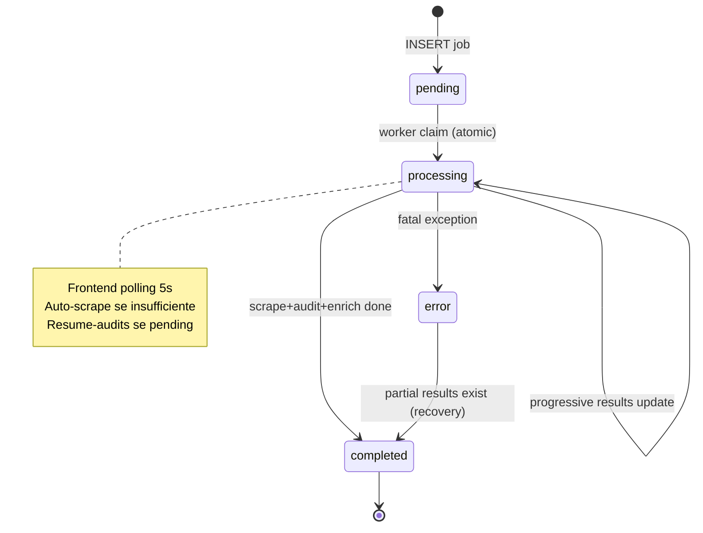
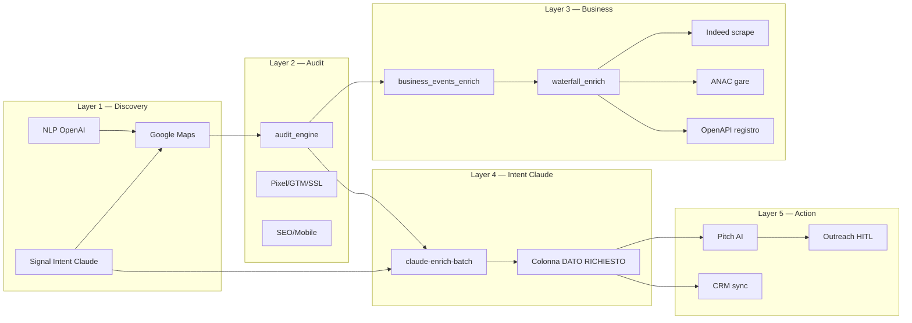

# MIRAX — Appendice Architettura Tecnica

**Documento principale:** `ARCHITETTURA_MIRAX_TECNICA_AZ.md`  
**Versione:** 2026-06-24

---

## A. Oggetto Lead — schema completo

Ogni elemento in `searches.results[]` (JSONB) è un lead normalizzato. Campi principali:

### A.1 Identità e contatti

| Campo IT | Alias EN | Tipo | Note |
|----------|----------|------|------|
| `azienda` | `nome`, `company`, `name` | string | Nome azienda |
| `telefono` | `phone` | string | Da Maps o sito |
| `email` | | string | Da sito/mailto |
| `sito` | `website`, `url` | string | URL sito |
| `citta` | `city`, `localita` | string | Città |
| `categoria` | `category` | string | Categoria Maps |
| `indirizzo` | `address` | string | |
| `rating` | `google_rating` | number | Rating Maps |

### A.2 Audit tecnico

| Campo | Tipo | Note |
|-------|------|------|
| `meta_pixel` | boolean | Meta Pixel rilevato |
| `google_tag_manager` | boolean | GTM |
| `google_analytics` | boolean | GA4 |
| `ssl` | boolean | HTTPS valido |
| `mobile_friendly` | boolean | |
| `tech_stack` | string[] | wordpress, shopify, … |
| `technical_report` | object | Audit engine output |
| `html_errors` | string[] | Errori HTML |
| `load_speed_s` | number | Secondi caricamento |
| `is_claimed` | boolean | Profilo Maps rivendicato |
| `instagram` | string | URL o N/D |
| `facebook` | string | |
| `linkedin` | string | |
| `audit` | object | Stato audit (pending/complete) |
| `last_audited_at` | ISO string | |

### A.3 Segnali business

| Campo | Tipo | Note |
|-------|------|------|
| `business_signals` | array | Segnali inline da worker |
| `business_hiring_jobs` | array | `{ title, url, source }` da Indeed |
| `business_events_audit_at` | ISO | Timestamp audit signals |
| `business_events_external_at` | ISO | Timestamp external (Indeed/ANAC) |
| `detected_crm_stack` | string[] | CRM rilevati |
| `openapi_enriched` | object | Dati registro OpenAPI |
| `fatturato` | number | Revenue |
| `dipendenti` | number | Employees |

### A.4 MIRAX enrich (frontend/Claude)

| Campo | Tipo | Note |
|-------|------|------|
| `claude_enrichment` | object | `{ matches_request, confidence, summary, evidence[], checked_at }` |
| `opportunity_score` | number | 0–100 |
| `freshness_score` | number | Decay 30 giorni |
| `audit_changes` | array | Diff audit nel tempo |

### A.5 Normalizzazione

`normalizeLeadFields()` in DashboardShell/actions — unifica alias IT/EN.  
`coerceLead()` in actions.ts — shape finale `RicercaRow`.

---

## B. Flussi E2E dettagliati

### B.1 Ricerca semplice categoria+città

```
Input: "imprese edili a Taranto"
  → NLP: city=Taranto, category=Imprese edili
  → parseSignalIntent: required_signals=[] (nessun segnale extra)
  → loadMergedSearchCache("Imprese edili", "Taranto")
  → Se cache OK: return N lead
  → Se cache vuota: INSERT searches pending → worker scrape
  → Filtro hasContact → dedup → use-credits(N)
  → UI: TUTTI i N lead visibili (no filtro auto)
  → Claude enrich: NON parte (no signalIntent)
  → Colonna Opportunità: badge Pixel/SEO da audit
```

### B.2 Ricerca intent hiring

```
Input: "Aziende che assumono programmatori Python a Milano"
  → parseSignalIntent: required_signals=[hiring], hiring_roles=[python, programmatore]
  → inferMapsCategoryFromIntent → "Servizi informatici" (NON idraulici/edili)
  → Maps scrape + audit
  → applySearchAiDebug → signalIntent in state
  → UI: TUTTI i lead Maps visibili
  → useEffect Claude: batch 15 → claude_enrichment per lead
  → Colonna ASSUNZIONI: viola/giallo/grigio
  → Parallel: worker external enrich Indeed (se ENRICH_BUSINESS_EVENTS=1)
  → Realtime: INSERT lead_business_signals → toast hot lead se score≥60
```

### B.3 Ricerca con filtri tecnici

```
Input: "Software house senza pixel a Roma"
  → NLP technical_filters: { no_pixel: true }
  → Maps: Servizi informatici, Roma
  → Post-fetch filter: meta_pixel !== true
  → Risultati già filtrati server-side (actions.ts)
  → UI: subset filtrato — NON è "filtro business" UI, è filtro NLP
```

### B.4 Auto-scrape incrementale

```
Condizione: results.length < maxLeads AND credits > 0 AND !isScraping
  → parseCategoryCityFromQuery(query)
  → POST /api/trigger-scrape { category, city, maxLeads }
  → requestIncrementalScrape → new pending job
  → Poll fino completed o searchExhausted
  → Merge nuovi lead in results (dedup)
  → Mercato esaurito: stop spinner, banner trasparenza contatti
```

### B.5 Resume audits

```
Condizione: countPendingAudits(results) > 0 AND worker idle
  → POST /api/resume-audits { leads: pending[] }
  → Per ogni lead: POST worker /audit-url
  → Merge audit data in results via merge-audit-into-lead.ts
  → UI aggiorna badge Opportunità
```

### B.6 Salvataggio lista

```
Click "Salva tutta la lista" o "Salva" singolo
  → POST /api/lists/bulk-save o /api/leads/save
  → INSERT list_leads / saved_leads
  → Opzionale: assegna a environment
```

### B.7 Sync CRM hot lead

```
Intent score ≥ 60 AND auto_sync_hot_leads ON
  → POST /api/crm/auto-sync { lead, intentScore }
  → NOUS normalizer → adapter attivo (HubSpot/Salesforce/webhook)
  → crm_sync_log INSERT
  → Dedup via crmSyncedKeysRef in DashboardShell
```

---

## C. Moduli `src/lib/` — inventario completo

| Cartella/File | Scopo |
|---------------|-------|
| `signal-intent/` | Parse, match, infer category, UI cells |
| `claude-intent-enrich/` | Claude batch enrich post-search |
| `mirax-signals.ts` | Unified signal analyzer |
| `business-events/` | Client-side business signal detectors |
| `realtime/signal-stream.ts` | Supabase Realtime subscription |
| `scoring/` | Intent score calculation |
| `search-cache.ts` | Cache merge category+city |
| `search-job-payload.ts` | Job insert payload, caps |
| `search-contact-quality.ts` | Contact validation |
| `lead-audit-status.ts` | Pending audit counting |
| `merge-audit-into-lead.ts` | Audit merge helper |
| `reaudit.ts` | Re-audit triggers |
| `discovery-intent-map.ts` | Discovery wizard query builder |
| `discovery-copy.ts` | Discovery UI strings |
| `ui-mode.ts` | Expert/Discovery persistence |
| `i18n/` | Locale IT/EN |
| `feature-flags.ts` | Feature toggles |
| `snov-enrichment.ts` | Snov API |
| `apollo-enrichment.ts` | Apollo API |
| `clay-enrichment.ts` | Clay API |
| `public-enrichment.ts` | Public sources |
| `free-enrichment.ts` | Free tier enrichment |
| `openapi-service.ts` | OpenAPI.it registry |
| `google-reviews.ts` | Google Places reviews |
| `website-deep-scraper.ts` | Deep site scrape |
| `nous/` | CRM integration layer |
| `crm/hub.ts`, `hub-core.ts` | CRM sync hub |
| `outbound/sequences.ts` | Email sequence engine |
| `outbound/ai-copywriter.ts` | AI email copy |
| `outreach.ts` | Outreach logging |
| `outreach-reply-classifier.ts` | Reply AI classification |
| `agents/` | Multi-agent orchestration |
| `research/` | Autonomous research agent |
| `knowledge-service.ts` | Knowledge CRUD |
| `knowledge-feed.ts` | Knowledge ingestion |
| `knowledge-embeddings.ts` | pgvector embeddings |
| `insights-data.ts` | Insights queries |
| `insights-action-rules.ts` | Insight action rules |
| `competitive/market-metrics.ts` | Market map metrics |
| `website-diff/` | Website change detection |
| `events/` | EDAT event emit/consume |
| `compliance/` | GDPR, Registro Opposizioni |
| `deliverability/` | DNS email checks |
| `pipeline-stages.ts` | Pipeline kanban stages |
| `pipeline-sync.ts` | Pipeline ↔ outreach sync |
| `ai-act-audit.ts` | AI Act compliance trail |
| `cron-auth.ts` | Cron route authentication |
| `api-auth.ts` | REST v1 API key auth |
| `intent-marketing-spend.ts` | Marketing spend detection |
| `subtypeRefinement.ts` | Category subtype refinement |

---

## D. Worker Python — inventario file

| File | Righe | Scopo |
|------|-------|-------|
| `worker_supabase.py` | ~3420 | Poller + FastAPI API |
| `main.py` | ~2468 | Playwright Maps + standalone API |
| `audit_engine.py` | ~441 | Technical site audit |
| `business_events_enrich.py` | ~934 | Business signals batch |
| `waterfall_enrich.py` | ~502 | Multi-source waterfall |
| `competitor_track.py` | ~76 | Competitor signal scan |
| `signal_intent_filters.py` | ~48 | Post-audit intent filters (stub) |
| `entity_matcher.py` | | Anti false-positive matching |
| `health_monitor.py` | | Source health/cooldown |
| `universal_cache.py` | | TTL query cache |
| `resilience.py` | | Circuit breaker, emergency mock |
| `report_generator.py` | | PDF audit reports |
| `google_reviews.py` | | Reviews scraper |

---

## E. Diagramma stati job `searches`



---

## F. Diagramma MIRAX Omnivoro — layer enrichment



---

## G. Checklist configurazione produzione-ready

### G.1 Vercel (ecosistema-mirax)

- [ ] `NEXT_PUBLIC_SUPABASE_URL` + keys
- [ ] `ANTHROPIC_API_KEY`
- [ ] `ANTHROPIC_API_KEY`
- [ ] `CLAUDE_ENRICH_MODEL=claude-sonnet-4-6`
- [ ] `BACKEND_URL=http://116.203.137.39:8002`
- [ ] `CRON_SECRET`
- [ ] Stripe/PayPal keys
- [ ] `SERPER_API_KEY` o `BRAVE_SEARCH_API_KEY`

### G.2 Worker Hetzner 116

- [ ] `.env` → Supabase **dev** URL + service role key
- [ ] `ENRICH_BUSINESS_EVENTS=1`
- [ ] `OPENAPI_IT_TOKEN`
- [ ] systemd units active
- [ ] `npm run check:worker-health` OK

### G.3 Supabase dev

- [ ] `npm run setup:ecosistema` eseguito
- [ ] RLS policies attive
- [ ] Realtime enabled su `lead_business_signals`

---

## H. Mappa interconnessioni componenti

```
DashboardShell
  ├── processSemanticSearch → actions.ts
  │     ├── parseSignalIntent → signal-intent/
  │     ├── inferMapsCategoryFromIntent
  │     ├── search-cache.ts
  │     └── Supabase searches INSERT
  ├── polling → Supabase searches SELECT
  ├── trigger-scrape → search-cache.requestIncrementalScrape
  ├── use-credits → profiles.credits
  ├── claude-enrich-batch → claude-intent-enrich/
  ├── resume-audits → worker /audit-url
  ├── realtime → signal-stream.ts → lead_business_signals
  └── displayResults → ResultsTable / DiscoveryResultsGrid
        ├── analyzeMiraxSignals → mirax-signals.ts
        ├── calcOpportunityScore → buyingSignals.ts
        ├── intentCellForLead → intent-cell.ts
        ├── generatePitchAction → OpenAI
        └── InviaCRMButton → /api/crm/auto-sync → nous/
```

---

## I. Test coverage per area

| Area | Script test |
|------|-------------|
| Signal intent parse | `test-signal-intent-parser.mjs` |
| Maps category inference | `test-maps-category-inference.mjs` |
| Business events | `test-business-events.mjs` |
| Search cache | `test-search-cache.mjs` |
| Claude enrich | (manuale — richiede ANTHROPIC_API_KEY) |
| Worker health | `check-worker-health.mjs` |
| Resume audits E2E | `test-resume-audits-e2e.mjs` |
| CRM sync | `test-crm-sync.mjs` |
| Research agent | `test-research-agent.mjs` |
| Discovery mode | `test-discovery-mode.mjs` |
| Compliance | `test-compliance.mjs` |
| Full suite | `npm run test:mirax-all` |

---

## J. Promote to production (Blocco 10)

Quando ecosistema dev è stabile:

1. Cherry-pick commit da `ecosistema-mirax` → `miraxgroupckb`
2. Applicare migration su Supabase **produzione**
3. Deploy worker su **178:8001** con `CONFIRM_PROD=1`
4. Aggiornare env Vercel produzione
5. Smoke test: ricerca, crediti, audit, billing
6. Monitor worker health 24h

**Mai** promuovere senza test completo su 116:8002.

---

*Appendice — complemento a `ARCHITETTURA_MIRAX_TECNICA_AZ.md`*
