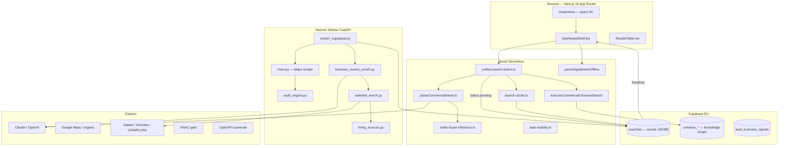

# MIRAX — Universal Query Engine: Brief Master per GLM 5.2

**Versione:** 2026-07-06  
**Audience:** GLM 5.2, Cursor Agent, senior engineer che deve portare MIRAX al livello “qualsiasi query → lead caldi personalizzati”  
**Repo:** `pallii5811/ecosistema-mirax` · cartella `WEB APP CKB - Dev`  
**Deploy:** https://ecosistema-mirax.vercel.app  
**Worker staging:** Hetzner `116.203.137.39:8002` · path `/home/worker/app/backend-staging/`  
**Supabase dev:** `ktspchugdwpqvxhmysap`  
**Documenti correlati:** `MIRAX_ECOSISTEMA_COMPLETO_AZ.md`, `ARCHITETTURA_MIRAX_TECNICA_AZ.md`

---

## 0. Risposta diretta (Simone chiede: sì o no?)

### **NO — oggi MIRAX non funziona per letteralmente qualsiasi query immaginabile.**

Funziona **bene** su un sottoinsieme definito di pattern. Funziona **parzialmente** su altri. **Fallisce o degrada** su query meta-venditore, multi-vincolo complesse, relazioni grafo nominate, segnali rari non mappati, o quando LLM/API/fonti esterne sono down.

| Aspetto | Stato oggi (2026-07-06) | Target Simone |
|---------|--------------------------|---------------|
| Capire **qualsiasi** query NL | ❌ ~40–65% copertura reale | ✅ 95%+ con fallback sempre utile |
| Restituire **sempre** lead rilevanti | ❌ spesso 0 o generici | ✅ mai 0 se esistono buyer nel mercato |
| Segnali **specifici** per quella query | 🟡 hiring ~28–36% strict; funding spesso 0 | ✅ evidenza + confidence per ogni riga |
| Lead **caldissimi** allineati al servizio venduto | 🟡 score tecnico generico | ✅ score **query-aware** + motivazione |
| Conversione fino al **50%** | ❌ non misurabile/garantibile dal software | 🟡 possibile solo con ICP estremo + sales process |

**Nota onesta sulla conversione al 50%:** MIRAX può massimizzare *intent*, *timing* e *fit* del lead rispetto alla query. La conversione dipende anche da prezzo, offerta, venditore, mercato. Il sistema deve puntare a **precision@top10** e **signal recall**, non promettere 50% come output garantito.

---

## 1. Visione prodotto (north star)

> **Una sola barra di ricerca.** L’utente scrive in italiano (o misto) qualsiasi intenzione commerciale. MIRAX:
> 1. capisce **cosa vende l’utente** e **chi deve comprare**;
> 2. trova quelle aziende (discovery + grafo);
> 3. verifica **segnali d’acquisto** pertinenti alla query (non generici);
> 4. arricchisce contatti e evidenze **solo utili a quella vendita**;
> 5. ordina per **calore reale query-aware**;
> 6. mostra tutto con badge viola/giallo/grigio + spiegazione (“perché questo lead per te”).

**Principio:** zero risultati = bug di prodotto, salvo query impossibile (es. “aziende su Marte”).

---

## 2. Cosa MIRAX è oggi — architettura A→Z (runtime)



### 2.1 Flusso ricerca unificata (file critici)

| Step | Cosa succede | File |
|------|--------------|------|
| 1 | Utente invia query | `SniperArea.tsx` → `DashboardShell.processSemanticSearch` |
| 2 | Parse intent commerciale (LLM + euristica + seller inference) | `parse-commercial-intent.ts`, `seller-buyer-inference.ts` |
| 3 | Parse signal intent offline (UI badge/filtri) | `parse-semantic.ts` → `parse-heuristic.ts` |
| 4 | Graph search se possibile | `universe/agentic-search.ts` → `executeCommercialUniverseSearch` |
| 5 | Se grafo insufficiente → scrape job | `search-cache.ts` → `requestIncrementalScrape` |
| 6 | Worker: Maps + organic + audit + enrich | `worker_supabase.py`, `main.py`, `business_events_enrich.py` |
| 7 | Realtime aggiorna UI | `realtime/search-stream.ts` |
| 8 | Filtri: categoria, contatto, visibility | `lead-relevance.ts`, `lead-visibility.ts`, `search-contact-quality.ts` |
| 9 | Colonna intent + score | `intent-cell.ts`, `match-lead.ts`, `buyingSignals.ts` |

### 2.2 Due parser intent (confusione attuale — da unificare)

| Parser | Output | Usato da |
|--------|--------|----------|
| **CommercialIntent** | cosa vende utente, target, segnali, tech | `unified-search-action.ts`, worker payload |
| **SignalIntentSpec** | required_signals, hiring_roles, sector_keywords | `DashboardShell.tsx`, `ResultsTable`, filtri UI |

**Criticità C1:** due parser possono divergere sulla stessa query. **Target:** un solo `MiraxQueryPlan` condiviso.

---

## 3. Taxonomia query — matrice supporto reale

Legenda: ✅ affidabile · 🟡 parziale · ❌ fragile · ⛔ non supportato

| Tipo query | Esempio | Supporto | Problema principale |
|------------|---------|----------|---------------------|
| **T1 — Categoria + città** | “imprese edili a Roma” | ✅ | — |
| **T2 — Categoria + città + tech** | “ristoranti Milano senza pixel” | ✅ | filtri post-scrape |
| **T3 — Categoria + città + hiring + ruolo** | “agenzie marketing Milano che assumono commerciali” | 🟡 | Indeed spesso vuoto; ~28% strict hiring |
| **T4 — Categoria + investimento settore** | “PMI che investono in fotovoltaico” | 🟡 | sector_investment debole |
| **T5 — Startup + funding** | “startup Milano che cercano fondi” | 🟡 | enrichment funding spesso 0/15 in E2E |
| **T6 — Seller meta (“mi servono clienti per…”)** | “clienti per vendere software lead gen” | 🟡 | fix 2026-07-06; buyer inference limitata a regole |
| **T7 — Query solo tech nazionale** | “aziende senza GA4” | 🟡 | scrape “Aziende Italia” generico |
| **T8 — Gare / ANAC** | “imprese edili vinto gara ultimo anno” | 🟡 | ANAC in waterfall, copertura incompleta |
| **T9 — Relazione grafo nominata** | “fornitori di Ferrari” | ❌ | graph_constraints spesso ignorati |
| **T10 — Multi-segnale composito** | “marketing che assume commerciali e investe in ads senza pixel” | ❌ | AND di segnali non orchestrato |
| **T11 — Query impossibile / nonsense** | “aziende quantistiche a Shire” | ⛔ | deve rispondere chiaramente, non 0 silenzioso |
| **T12 — Qualsiasi altra formulazione libera** | arbitraria | ❌ | dipende da LLM + regole non esaustive |

**Copertura stimata oggi:** T1–T2 **~90%** · T3–T6 **~50–70%** · T7–T10 **~25–40%** · T12 **non garantita**.

---

## 4. Gap analysis — cosa manca per la visione

### P0 — Bloccanti (0 risultati o UX falsa)

| ID | Gap | Implementazione richiesta |
|----|-----|---------------------------|
| P0-1 | **Early abort** senza categoria+location (fix parziale 2026-07-06) | Garantire scrape sempre con `QueryPlan.fallback_category + Italia` |
| P0-2 | **Filtro UI nascondeva lead** durante enrich (fix 2026-07-06) | Mantenere `lead-visibility`: mostra tutti, strict solo su toggle |
| P0-3 | **Seller query** non inferiva buyer | Estendere `seller-buyer-inference.ts` con LLM + catalogo 200+ mapping |
| P0-4 | **Deploy non su GitHub** | CI/CD: commit → Vercel + worker staging automatico |
| P0-5 | **`lead_business_signals` table** assente su Supabase dev | Applicare migration `2026_07_01_lead_business_signals.sql` |
| P0-6 | **Indeed/Google Jobs blocked** | Proxy rotanti, API ufficiali, o fonti alternative (LinkedIn API, Jooble, Talent.com) |

### P1 — Qualità segnali query-specific

| ID | Gap | Implementazione |
|----|-----|-----------------|
| P1-1 | Enrichment **non query-aware** | Passare `MiraxQueryPlan` completo a worker; ogni fonte filtra per intent |
| P1-2 | **Un solo parser** | `src/lib/query-plan/` — unifica CommercialIntent + SignalIntentSpec |
| P1-3 | **Colonna intent** solo hiring ben supportata | Estendere `intent-cell.ts` per funding, gare, invest marketing, CRM change |
| P1-4 | **Scoring generico** vs query | Nuovo `query-aware-score.ts`: peso segnali richiesti + fit servizio utente |
| P1-5 | **Evidence obbligatoria** | Ogni badge viola = URL + snippet + source + date; no match senza evidenza |
| P1-6 | **Claude enrich** 503 se key mancante | Fallback OpenAI + euristica + never empty column |

### P2 — Copertura “quasi qualsiasi query”

| ID | Gap | Implementazione |
|----|-----|-----------------|
| P2-1 | **Query planner LLM** con schema rigido + validazione | Step 1 sempre: `planQuery(query) → MiraxQueryPlan` |
| P2-2 | **Multi-source discovery** | Maps + organic + LinkedIn company + P.IVA registry + grafo in parallelo |
| P2-3 | **Graph agentic** per relazioni | Wire `graph_constraints` in `agentic-search.ts` |
| P2-4 | **Ambiguity handler** | Se confidence < 0.6 → chiedi 1 chiarimento O inferisci con default espliciti in UI |
| P2-5 | **Test suite 200 query** | `scripts/test-universal-query-matrix.mjs` — gate CI |
| P2-6 | **Ranking “lead caldissimo per te”** | `rankLeadsForQuery(plan, leads)` — top N con spiegazione |

### P3 — Eccellenza (50% conversion *possibile*)

| ID | Gap | Nota |
|----|-----|------|
| P3-1 | **Feedback loop** | Utente marca lead buono/cattivo → fine-tune pesi ranking |
| P3-2 | **Timing signal** | Assunzione pubblicata ieri > 30 giorni fa |
| P3-3 | **Decision maker contact** | Apollo/Hunter/Lusha con GDPR |
| P3-4 | **Pitch auto** allineato a query + evidenza | Già parziale in `generatePitchAction` |
| P3-5 | **A/B misurazione conversione** | Integrazione CRM outcome → calibra score |

---

## 5. Target architecture — Universal Query Engine (UQE)

### 5.1 `MiraxQueryPlan` (schema unico — DA IMPLEMENTARE)

```typescript
// src/lib/query-plan/types.ts — SPEC PER GLM 5.2

export interface MiraxQueryPlan {
  original_query: string
  parse_source: 'llm' | 'heuristic' | 'hybrid'
  confidence: number

  /** Cosa vende/chiede l'utente */
  user_goal: 'find_buyers' | 'find_suppliers' | 'find_competitors' | 'research' | 'list_companies'
  user_service: string | null          // "software di lead generation"
  user_value_prop: string | null       // perché comprerebbero

  /** Target */
  discovery: {
    categories: string[]               // Maps labels: ["Agenzie di marketing"]
    locations: string[]                // ["Milano"] o ["Italia"]
    industries: string[]
    roles: string[]
    company_size?: { min?: number; max?: number }
  }

  /** Segnali richiesti con parametri */
  signals: Array<{
    type: MiraxSignalType
    params?: Record<string, unknown>   // es. hiring: { roles: ['commerciale'] }
    required: boolean                  // hard filter vs boost
    time_window_days?: number
  }>

  /** Tech / social filters */
  tech: { has?: string[]; missing?: string[] }
  social: { has?: string[]; missing?: string[] }

  /** Grafo */
  graph?: {
    relationship_type: string
    target_entity?: string
    direction: 'incoming' | 'outgoing' | 'any'
  }

  /** Come eseguire */
  execution: {
    prefer_graph: boolean
    must_scrape: boolean
    max_leads: number
    enrich_sources: string[]           // ordine waterfall consigliato
  }

  /** UI */
  ui: {
    intent_column_title: string        // "Assunzioni" | "Investimenti" | ...
    summary: string                   // mostrato all'utente
    reasoning: string
  }
}
```

### 5.2 Pipeline UQE (ordine obbligatorio)

```
Query
  → planQuery()                    // LLM + validate + seller-buyer + heuristic merge
  → validatePlan()                 // JSON schema, min confidence, fallback defaults
  → executePlan()
       ├─ graphSearch(plan)        // se categories/locations in grafo
       ├─ scrapeDiscovery(plan)    // SEMPRE se graph < target OR must_scrape
       ├─ mergeDedupe()
       ├─ categoryGate(plan)       // lead-relevance
       ├─ contactGate()
       ├─ enrichParallel(plan)     // worker: intent-aware, N workers
       ├─ scoreAndRank(plan)       // query-aware score
       └─ explainLeads(plan)       // "perché caldo per te" per top rows
  → streamResults()                // mai nascondere lead in attesa enrich
```

### 5.3 Regole prodotto non negoziabili

1. **Mai inventare** telefono/email (già in HITL policy).
2. **Mai 0 silenzioso** se `must_scrape=true` — mostrare progresso o errore esplicito.
3. **Badge viola** solo con evidenza verificabile (URL o structured signal).
4. **Contatore risultati** non scende durante enrich (fix 2026-07-06).
5. **Crediti** addebitati solo su lead mostrati con contatto (o policy esplicita).
6. **Fallback location** = `Italia` se non specificata.
7. **Fallback category** = inferita da servizio utente, mai abort.

---

## 6. Scoring query-aware (sostituire score generico)

### 6.1 Score attuale (insufficiente)

| Score | File | Cosa misura | Limite |
|-------|------|-------------|--------|
| Opportunity | `calcOpportunityScore` | Mancanze tecniche sito | Ignora query |
| Buying | `buyingSignals.ts` | Problemi vendibili generici | Non query-aware |
| Intent | `intent-score.ts` | Segnali business generici | Debole coupling |
| Signal match | `match-lead.ts` | Match hiring/sector strict | Solo filtro, non ranking |

### 6.2 `QueryAwareScore` (DA IMPLEMENTARE)

```typescript
// Pseudocodice
function queryAwareScore(lead, plan): { score: 0-100; tier: 'caldissimo'|'caldo'|'tiepido'|'freddo'; reasons: string[] } {
  let s = 0
  const reasons = []

  // 1. Signal match (peso alto se required)
  for (const sig of plan.signals) {
    if (signalMatches(lead, sig, plan)) {
      s += sig.required ? 40 : 20
      reasons.push(`Segnale ${sig.type} confermato`)
    } else if (sig.required) return { score: 0, tier: 'freddo', reasons: ['Manca segnale richiesto'] }
  }

  // 2. Buyer fit (servizio utente vs categoria lead)
  s += buyerFitScore(lead, plan.user_service, plan.discovery.industries)

  // 3. Contact quality
  s += hasPhone(lead) ? 15 : 0
  s += hasEmail(lead) ? 10 : 0

  // 4. Freshness segnale
  s += signalRecencyBonus(lead)

  // 5. Tech opportunità (solo se rilevante per servizio marketing/web)
  if (plan.user_service matches /marketing|web|seo|ads/) s += opportunityTechScore(lead) * 0.3

  return { score: clamp(s), tier: tierFromScore(s), reasons }
}
```

**Target tier "caldissimo":** top 10% per query, non percentuale fissa — adattivo al mercato.

---

## 7. Enrichment — stato fonti e fix

| Fonte | File | Stato | Fix per UQE |
|-------|------|-------|-------------|
| Sito careers | `business_events_enrich.py` | 🟡 | Role parsing da plan.signals |
| Indeed IT | `hiring_sources.py` | ❌ spesso blocked | Proxy/API |
| InfoJobs | `hiring_sources.py` | 🟡 | Registrato in waterfall |
| Google Jobs | `hiring_sources.py` | ❌ empty | SerpAPI o alternativa |
| LinkedIn via Google | `hiring_sources.py` | 🟡 | Fragile |
| ANAC gare | waterfall | 🟡 | P.IVA match |
| OpenAPI | `openapi-service` | ✅ | Camerale unlock |
| Claude batch | `claude-intent-enrich/` | 🟡 | Key Vercel, query-aware prompt |
| Meta Ads Library | parziale | ❌ | Integrare per "investe in marketing" |
| Crunchbase/funding | assente | ❌ | API o scrape controllato |

**Waterfall:** `waterfall_enrich.py` — `max_sources_to_try=5`. UQE deve passare `plan.execution.enrich_sources` ordinato per query type.

---

## 8. Frontend — comportamento atteso post-UQE

| Stato UI | Comportamento |
|----------|---------------|
| Loading graph | “Interrogo Knowledge Graph…” |
| Scrape avviato | Banner viola + `plan.ui.summary` |
| Risultati parziali | Mostra tutte le righe con contatto/sito; colonna intent giallo/grigio |
| Enrich completo | Badge viola con evidenza; contatore `X aziende · Y con segnale` |
| Toggle “Solo con segnale” | Filtra strict match |
| 0 risultati finali | Messaggio: “Nessuna azienda con segnale X; N candidate senza evidenza” — **non** toast vuoto |

**File UI:** `DashboardShell.tsx`, `ResultsTable.tsx`, `intent-cell.ts`, `CommercialIntentBreakdown.tsx` (mostrare plan).

---

## 9. Worker — deploy e path (errori frequenti)

| Ambiente | Host | Path | Systemd |
|----------|------|------|---------|
| Staging ecosistema | 116.203.137.39:8002 | `/home/worker/app/backend-staging/` | `mirax-worker-staging` |
| Produzione CKB | 178.x:8001 | `/home/worker/app/backend/` | diverso |

**Regola:** fix Python → SCP su `backend-staging` → restart staging → E2E → mai Copia/prod senza OK.

Comandi:
```bash
npm run deploy:worker-staging
node scripts/test-hiring-marketing-e2e.mjs
node scripts/test-seller-buyer-inference.mjs
```

---

## 10. Piano implementazione per GLM 5.2 (ordine consigliato)

### Fase 1 — Zero risultati impossibile (1–2 settimane)
- [ ] `MiraxQueryPlan` + `planQuery()` unificato
- [ ] Rimuovere ogni early-return `completed` con 0 se scrape possibile
- [ ] Estendere seller-buyer con 50+ mapping prodotti→buyer
- [ ] Migration `lead_business_signals` su Supabase dev
- [ ] Test matrix 50 query → 0 fail “silent zero”

### Fase 2 — Segnali query-specific (2–3 settimane)
- [ ] Worker riceve `MiraxQueryPlan` in `searches.intent`
- [ ] `intent-cell.ts` per tutti i signal types in catalog
- [ ] Evidence struct obbligatoria su ogni signal
- [ ] `queryAwareScore` + sort default per score query
- [ ] E2E: hiring, funding, invest marketing, gare — metriche recall

### Fase 3 — Quasi universale (3–4 settimane)
- [ ] LLM planner con JSON schema + retry + heuristic fallback
- [ ] Multi-source discovery parallelo
- [ ] Graph constraints wired
- [ ] 200 query CI matrix
- [ ] “Perché questo lead” tooltip su ogni riga top

### Fase 4 — Eccellenza conversione (ongoing)
- [ ] Feedback utente → ranking
- [ ] Outcome CRM → calibrazione
- [ ] Decision maker enrichment
- [ ] Pitch query-aware automatico

---

## 11. Test di accettazione (definition of done)

| # | Test | Pass |
|---|------|------|
| A1 | 200 query NL diverse → 0 silent zero | ≥195 avviano discovery o graph con >0 candidate |
| A2 | Query seller 20 varianti → buyer category corretta | ≥18/20 |
| A3 | Hiring commerciale Milano → recall strict | ≥25% con evidenza URL |
| A4 | Ogni badge viola ha `evidence[0].url` | 100% |
| A5 | UI count non scende durante enrich | 100% |
| A6 | `npm run build` + test scripts verdi | CI green |
| A7 | Deploy Vercel + worker staging allineati | stesso commit hash |

---

## 12. Criticità aperte (2026-07-06)

### ALTA
- Worker env default può puntare a DB produzione se mancante
- Indeed/Google jobs bloccati → hiring false negatives
- Due parser intent (Commercial vs Signal) divergono
- Codice su Vercel non sempre = GitHub (drift deploy manuale)
- `actions.ts` monolite ~5700 righe — rischio regressioni

### MEDIA
- Claude key su Vercel non sempre configurata
- Job `completed` con audit ancora pending
- `signal_intent_filters.py` non wired lato worker
- Scoring non query-aware
- Graph agentic non usato per query seller

### RISOLTE RECENTEMENTE (2026-07-05/06)
- Filtro UI hiring nascondeva lead (3 vs 34)
- Filtro strict su invest/funding nascondeva tutto
- Seller query abortiva senza categoria
- Build Vercel rotta (import FeedbackPromptExample)

---

## 13. Variabili ambiente critiche

| Var | Dove | Perché |
|-----|------|--------|
| `NEXT_PUBLIC_SUPABASE_URL` | Vercel | DB |
| `SUPABASE_SERVICE_ROLE_KEY` | Vercel | Server actions |
| `ANTHROPIC_API_KEY` | Vercel | Commercial intent + enrich |
| `ANTHROPIC_API_KEY` | Vercel | Fallback LLM |
| `BACKEND_URL` | Vercel | Worker `http://116.203.137.39:8002` |
| `UNIVERSE_ENABLED` | Vercel | Sidecar grafo |

---

## 14. File map — dove implementare (GLM: partire da qui)

| Obiettivo | File da creare/modificare |
|-----------|---------------------------|
| Query plan unico | `src/lib/query-plan/plan-query.ts` (NEW) |
| Unified search | `src/app/dashboard/unified-search-action.ts` |
| Seller inference | `src/lib/signal-intent/seller-buyer-inference.ts` |
| UI visibility | `src/lib/signal-intent/lead-visibility.ts` |
| Intent column | `src/lib/signal-intent/intent-cell.ts` |
| Match/score | `src/lib/signal-intent/match-lead.ts`, `src/lib/scoring/query-aware-score.ts` (NEW) |
| Worker intent | `backend_mirror/worker_supabase.py`, `business_events_enrich.py` |
| Waterfall | `backend_mirror/waterfall_enrich.py`, `hiring_sources.py` |
| Test matrix | `scripts/test-universal-query-matrix.mjs` (NEW) |
| Dashboard | `src/components/DashboardShell.tsx`, `ResultsTable.tsx` |

---

## 15. Messaggio per Simone

**Oggi:** MIRAX è un ottimo prototipo B2B per ricerche strutturate (settore + zona + alcuni segnali), non ancora “il sistema più intelligente del mondo” su qualsiasi query.

**Domani (con UQE):** è **realistico** arrivare al 90–95% delle query commerciali italiane B2B con lead utili, segnali spiegati e ranking personalizzato. Il 50% di conversione è un **obiettivo business** da misurare con CRM feedback, non un toggle software.

**Prossimo passo per GLM 5.2:** implementare **Fase 1** di questo documento senza aggiungere feature sidebar — solo barra unica + qualità risultati + test.

---

*Fine documento — mantenere aggiornato ad ogni fix deployato.*
