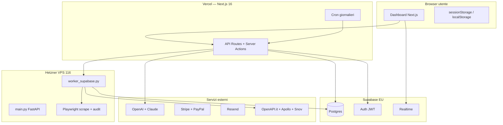

# MIRAX Ecosistema — Documentazione Completa A → Z

**Versione:** 2026-07-06  
**Repo attivo:** `pallii5811/ecosistema-mirax`  
**Cartella locale:** `WEB APP CKB - Dev`  
**Deploy app:** https://ecosistema-mirax.vercel.app  
**Worker staging:** Hetzner `116.203.137.39:8002`  
**Supabase dev:** `ktspchugdwpqvxhmysap` (EU West)

> **Documento canonico** del progetto ecosistema MIRAX. Spiega in linguaggio chiaro **cosa fa ogni parte**, come comunica col database, e l’architettura tecnica.  
> Per il dettaglio storico sezione-per-sezione vedi anche `ARCHITETTURA_MIRAX_TECNICA_AZ.md`.  
> **Brief Universal Query (GLM 5.2 — gap, criticità, piano):** `docs/GLM52_UNIVERSAL_QUERY_MASTER_BRIEF.md`  
> **Inventario file (646 path):** `docs/MIRAX_FILE_INVENTORY.txt`

---

## Indice

1. [Cosa è MIRAX — in parole semplici](#1-cosa-è-mirax--in-parole-semplici)
2. [Ambienti Dev vs Produzione](#2-ambienti-dev-vs-produzione)
3. [Architettura generale — chi parla con chi](#3-architettura-generale--chi-parla-con-chi)
4. [Stack tecnologico](#4-stack-tecnologico)
5. [Struttura del repository](#5-struttura-del-repository)
6. [Database Supabase — tutte le tabelle](#6-database-supabase--tutte-le-tabelle)
7. [Autenticazione, sicurezza, RLS](#7-autenticazione-sicurezza-rls)
8. [Ricerca unificata — Discovery, Grafo, Ibrido](#8-ricerca-unificata--discovery-grafo-ibrido)
9. [Knowledge Graph (Universe)](#9-knowledge-graph-universe)
10. [Signal Intent e MIRAX Omnivoro](#10-signal-intent-e-mirax-omnivoro)
11. [Worker Python e pipeline dati](#11-worker-python-e-pipeline-dati)
12. [Enrichment — tutte le fonti](#12-enrichment--tutte-le-fonti)
13. [Frontend — ogni pagina dashboard](#13-frontend--ogni-pagina-dashboard)
14. [Componenti UI — catalogo](#14-componenti-ui--catalogo)
15. [src/lib — logica applicativa](#15-srclib--logica-applicativa)
16. [API Routes — catalogo completo](#16-api-routes--catalogo-completo)
17. [Cron, eventi, realtime](#17-cron-eventi-realtime)
18. [Billing, crediti, CRM, outreach](#18-billing-crediti-crm-outreach)
19. [Agenti AI e Centro Comando](#19-agenti-ai-e-centro-comando)
20. [Variabili d’ambiente](#20-variabili-dambiente)
21. [Deploy, test, operazioni](#21-deploy-test-operazioni)
22. [Roadmap blocchi 0–10 + Universe](#22-roadmap-blocchi-010--universe)
23. [Glossario](#23-glossario)
24. [Appendice — migrazioni SQL](#24-appendice--migrazioni-sql)
25. [Universal Query — stato reale e roadmap (2026-07-06)](#25-universal-query--stato-reale-e-roadmap-2026-07-06)

---

## 1. Cosa è MIRAX — in parole semplici

MIRAX è una **piattaforma B2B italiana** che aiuta agenzie e commerciali a:

1. **Trovare** aziende target (per settore, città, segnali business)
2. **Analizzare** i loro siti (tecnologie, errori SEO, pixel, velocità)
3. **Arricchire** con dati esterni (assunzioni, gare, fatturato, CRM)
4. **Contattare** con pitch AI e sequenze email (con approvazione umana)
5. **Gestire** il deal in pipeline e sincronizzarlo col CRM

### I tre pilastri del prodotto

| Pilastro | Cosa significa per l’utente | Dove vive nel codice |
|----------|----------------------------|----------------------|
| **Segnale** | “Questa azienda sta assumendo / ha vinto una gara / investe in marketing” | `business-events/`, worker, waterfall |
| **Audit** | “Il sito non ha pixel / è lento / ha errori SEO” | `audit_engine.py`, `buyingSignals.ts` |
| **Azione** | Pitch, email, WhatsApp, pipeline, CRM | `outreach/`, `sequences/`, `nous/`, `pipeline/` |

### MIRAX “Omnivoro” — cosa significa **oggi** (onesto)

L’obiettivo prodotto è accettare **query in linguaggio naturale libero**. Lo stato **reale** a luglio 2026:

| Capacità | Stato |
|----------|-------|
| Settore + città (“edili Roma”) | ✅ Affidabile |
| Settore + città + audit tech (“senza pixel”) | ✅ Affidabile |
| Settore + città + hiring + ruolo | 🟡 ~25–35% con evidenza strict |
| Query venditore (“mi servono clienti per…”) | 🟡 Fix recente; mapping buyer limitato |
| Funding / investimenti / gare | 🟡 Enrichment spesso incompleto |
| Relazioni grafo (“fornitori di X”) | ❌ Parziale |
| **Qualsiasi query immaginabile** | ❌ **No** |

Il flusso attuale:

1. **Interpreta** → `parseCommercialIntent()` + `parseSignalIntentOffline()` + `seller-buyer-inference.ts`
2. **Traduce** in categoria Maps + città (fallback `Italia`) + segnali
3. **Scopre** → Discovery (worker) e/o Knowledge Graph
4. **Audita** ogni sito → motore audit Playwright
5. **Arricchisce** → waterfall (Indeed, careers, ANAC, Claude…)
6. **Mostra** risultati — **tutti** i lead con badge viola/giallo/grigio (non nascondere in attesa)

**Documento completo gap + piano GLM 5.2:** `docs/GLM52_UNIVERSAL_QUERY_MASTER_BRIEF.md`

**Regola d’oro:** MIRAX non inventa email o telefoni. Ogni contatto proviene da fonti verificabili (sito, directory, enrichment).

---

## 2. Ambienti Dev vs Produzione

| | **Dev / Ecosistema** | **Produzione** |
|--|----------------------|----------------|
| Cartella | `WEB APP CKB - Dev` | `WEB APP CKB - Copia` |
| GitHub | `ecosistema-mirax` | `miraxgroupckb` |
| URL | `ecosistema-mirax.vercel.app` | `miraxgroup.it` |
| Supabase | `ktspchugdwpqvxhmysap` | progetto produzione |
| Worker | Hetzner **116:8002** | Hetzner **178:8001** |
| Regola | Sviluppo e test **solo qui** | Intoccabile salvo hotfix urgenti |

**Perché due ambienti:** il worker scrapa il web e scrive migliaia di righe. Un errore in staging non deve mai corrompere i dati dei clienti in produzione.

---

## 3. Architettura generale — chi parla con chi



### Flusso tipico di una ricerca

1. L’utente digita una query e sceglie il **motore** (Discovery live / Knowledge Graph / Ibrido).
2. **DashboardShell** chiama `processSemanticSearchAction` (Server Action) o `runAgenticUniverseSearch` (API grafo).
3. Next.js crea/aggiorna una riga in `searches` con status `pending`.
4. Il **worker** su Hetzner legge il job, esegue scrape + audit + enrichment, scrive `results` JSONB.
5. Il frontend **polla** `/api/check-scrape-job` fino a `completed`.
6. I lead vengono normalizzati, filtrati per contatto, e addebitati i **crediti**.
7. Se `UNIVERSE_ENABLED=1`, un **sidecar** duplica i dati nel Knowledge Graph (`universe_*`).

---

## 4. Stack tecnologico

| Layer | Tecnologia | Ruolo |
|-------|------------|-------|
| Frontend | Next.js 16 App Router, React 19 | UI, routing, SSR |
| Stile | Tailwind 4, shadcn, Radix | Componenti accessibili |
| Linguaggio | TypeScript 5 strict | Type safety end-to-end |
| Database | Supabase Postgres | Dati, auth, realtime, RLS |
| AI parsing | OpenAI GPT-4o-mini | Query → filtri JSON |
| AI enrich | Anthropic Claude Sonnet | Intent parse + enrich batch |
| Worker | Python 3, FastAPI, Playwright | Scrape, audit, job pesanti |
| Pagamenti | Stripe + PayPal | Abbonamenti e crediti |
| Email | Resend | Sequenze, welcome, deliverability |
| Deploy FE | Vercel | Hosting + cron serverless |
| Deploy worker | Hetzner + systemd | Processi long-running |

---

## 5. Struttura del repository

```
WEB APP CKB - Dev/
├── src/
│   ├── app/              # Pagine + API routes (Next.js App Router)
│   ├── components/       # UI React (~110 componenti)
│   ├── lib/              # Business logic (~155 moduli TS)
│   ├── types/            # Tipi condivisi
│   ├── utils/supabase/   # Client browser/server/service-role
│   └── styles/           # CSS landing
├── backend_mirror/       # Worker Python + FastAPI (deploy Hetzner)
│   ├── universe/         # Sidecar ingest Knowledge Graph (Python)
│   ├── scripts/          # Deploy staging/prod
│   └── systemd/          # Unit files systemd
├── db/
│   ├── bootstrap/        # Schema base generato
│   └── migrations/       # 26 migrazioni incrementali
├── docs/                 # Documentazione (questo file incluso)
├── scripts/              # ~90 script test/setup Node
├── public/               # Asset statici (logo MIRAX)
├── package.json          # Dipendenze e script npm
└── vercel.json           # Cron Vercel
```

**Package npm:** `client-sniper` (nome storico interno).

**Script principali:**
- `npm run dev` — sviluppo locale
- `npm run build` — build produzione
- `npm run test:universe` — suite completa Knowledge Graph
- `npm run test:mirax-all` — test ecosistema blocchi 1–9
- `npm run deploy:worker-staging` — deploy worker su 116

---

## 6. Database Supabase — tutte le tabelle

Supabase è il **centro dati**. Ogni componente legge/scrive qui.

### 6.1 Core lead generation (legacy, ancora source of truth)

| Tabella | Scopo | Chi scrive | Chi legge |
|---------|-------|------------|-----------|
| `profiles` | Utente, crediti, piano, preferenze | trigger auth, API profile | tutta l’app |
| `searches` | Job ricerca: query, filtri, status, **results JSONB** | actions.ts, worker | DashboardShell, check-scrape-job |
| `leads` | Lead salvati singolarmente | API leads/save | lead detail |
| `lists` | Liste personali | API lists | dashboard/leads |
| `list_leads` | Lead in una lista | API lists | liste |
| `environments` | “Ambiente” tematico (raggruppa ricerche) | environments/actions | dashboard/environments |
| `lead_pipeline` | Kanban CRM interno | API pipeline | dashboard/pipeline |
| `lead_interactions` | Storico azioni su lead | varie API | scoring feedback |
| `company_lookup_cache` | Cache P.IVA OpenAPI | openapi-service | lead-registry |
| `user_openapi_unlocks` | Audit sblocco dati camerale | business-data-unlock | billing |

**`searches.results`:** array JSONB di lead. Ogni oggetto contiene azienda, telefono, email, sito, audit, segnali business, enrich Claude. Vedi appendice lead in `ARCHITETTURA_MIRAX_TECNICA_AZ_APPENDICE.md`.

### 6.2 Outreach e sequenze

| Tabella | Scopo |
|---------|-------|
| `outreach_log` | Log ogni tentativo outreach (canale, messaggio, anti-ban) |
| `outbound_queue` | Coda invii in attesa approvazione HITL |
| `sequences` | Definizione campagne email multi-step |
| `sequence_runs` | Esecuzione campagna su lead |
| `scheduled_emails` | Email programmate da cron dispatch |
| `inbound_reply_classifications` | Classificazione risposte AI (HITL) |
| `gmail_connections` | Token OAuth Gmail read-only |

### 6.3 Insights, knowledge, eventi

| Tabella | Scopo |
|---------|-------|
| `mirax_events` | Event bus EDAT (azioni, alert, hot lead) |
| `knowledge_objects` | Oggetti knowledge + embedding pgvector |
| `research_cache` | Cache 24h research agent |
| `lead_business_signals` | Segnali business persistiti per lead |
| `ai_audit_trail` | Tracciamento decisioni AI (AI Act) |
| `compliance_checks` | Check GDPR / Registro Opposizioni |

### 6.4 CRM e competitor

| Tabella | Scopo |
|---------|-------|
| `crm_integrations` | Connessioni HubSpot/Salesforce |
| `crm_sync_history` | Storico sync CRM |
| `competitors` | Competitor tracciati |
| `competitor_alerts` | Alert movimenti competitor |

### 6.5 Knowledge Graph (Universe) — modello UDM

| Tabella | Scopo |
|---------|-------|
| `universe_entities` | **Nodi** del grafo (aziende, persone, tech, job…) |
| `universe_entity_aliases` | Alias per dedup (dominio, P.IVA, telefono) |
| `universe_observations` | **Fatti temporali** (pixel=false il 2026-01-15, revenue=2M…) |
| `universe_relationships` | **Archi** (hires, uses_technology, located_in…) |
| `universe_events` | Eventi dominio (signal_detected, audit_completed…) |
| `universe_user_context` | Contesto **privato** utente (saved, contacted, pipeline) |
| `universe_query_cache` | Cache query agentic/analytics |
| `universe_webhook_deliveries` | Log consegne webhook grafo |

**Pattern sidecar:** le tabelle legacy (`searches`) restano la verità operativa. Con `UNIVERSE_ENABLED=1`, ogni lead arricchito viene **anche** scritto nel grafo. La lettura grafo non costa crediti discovery.

### 6.6 Funzioni SQL importanti

- `universe_latest_observation(entity_id, attribute)` — ultimo valore osservato
- `universe_related_entities(entity_id)` — entità collegate
- `universe_resolve_entity_by_alias(type, value)` — risoluzione dominio/telefono
- `universe_analytics_summary()` — KPI grafo per dashboard analytics

---

## 7. Autenticazione, sicurezza, RLS

### Come funziona l’auth

1. L’utente fa login via Supabase Auth (email/password).
2. Il JWT viene salvato in cookie httpOnly (middleware Next.js).
3. Ogni API route chiama `createServerClient()` e verifica `getUser()`.
4. Le query usano `user_id` dal JWT per filtrare i dati.

### Row Level Security (RLS)

- **`searches`, `lists`, `pipeline`:** solo il proprietario (`user_id`) vede i propri dati.
- **`universe_entities`, observations, relationships, events`:** lettura **pubblica** tra utenti autenticati (grafo condiviso MIRAX).
- **`universe_user_context`:** **privato** per utente (note, saved, hidden).

### Segreti

- `SUPABASE_SERVICE_ROLE_KEY` — solo server/worker, bypass RLS per job di sistema.
- `CRON_SECRET` — protegge endpoint cron Vercel.
- Mai esporre service role al browser.

---

## 8. Ricerca unificata — Discovery, Grafo, Ibrido

**Aggiunto 2026-06-29.** Una sola barra di ricerca, tre motori.

### File coinvolti

| File | Ruolo |
|------|-------|
| `src/lib/search-source.ts` | Tipi e meta copy dei 3 motori |
| `src/components/SearchSourceToggle.tsx` | UI pillole “Motore” |
| `src/components/DashboardShell.tsx` | Orchestrazione `processSemanticSearch` |
| `src/components/SniperArea.tsx` | Barra ricerca + disabilita crediti se grafo |
| `src/lib/universe/client.ts` | `runAgenticUniverseSearch()` |

### I tre motori (terminologia UI — mai “Maps”)

| Motore | Chiave interna | Cosa fa | Crediti |
|--------|----------------|---------|---------|
| **Discovery live** | `maps` | Scansione territoriale: directory, registri, fonti web | Sì |
| **Knowledge Graph** | `graph` | Query istantanea sul grafo MIRAX arricchito | No |
| **Grafo + Discovery** | `hybrid` | Prima grafo, poi discovery per completare il target | Solo parte discovery |

### Flusso Discovery live

```
Query utente
  → processSemanticSearchAction (actions.ts)
  → parseSignalIntent (Claude/heuristic)
  → INSERT searches (pending)
  → worker scrape + audit + enrich
  → poll check-scrape-job
  → normalizeLeadFields + filtro contatto
  → use-credits (1 credito = 1 lead mostrato)
```

### Flusso Knowledge Graph

```
Query utente
  → runAgenticUniverseSearch
  → POST /api/universe/agentic-search
  → signalIntentToUniverseQuery
  → executeUniverseQuery + graph-ranking
  → risultati come righe lead compatibili ResultsTable
  → zero crediti
```

### Flusso Ibrido

1. Esegue grafo fino a `maxLeads` o esaurimento grafo.
2. Se mancano lead, avvia discovery per la differenza.
3. Addebita crediti **solo** sui lead discovery (non quelli dal grafo).

### Link al grafo visuale

Dopo una ricerca, **“Visualizza nel grafo”** apre `/dashboard/universe?city=…&name=…` con canvas nodi/archi.

---

## 9. Knowledge Graph (Universe)

### Cos’è, in pratica

Una **memoria condivisa** di tutte le aziende che MIRAX ha già analizzato. Non è una seconda ricerca web: legge ciò che il sistema ha già imparato.

### Fasi implementate (0–10)

| Fase | Contenuto | File chiave |
|------|-----------|-------------|
| 1 | Schema DB 6 tabelle | `2026_07_02_universe_entities.sql` |
| 2 | Ingest sidecar Python + TS | `ingest-lead.ts`, `backend_mirror/universe/` |
| 3 | Query builder strutturato | `query-builder.ts` |
| 4 | Hydrate lead da grafo | `hydrate-leads.ts` |
| 5 | Agentic Search UI | `agentic-search.ts`, `AgenticSearchPanel.tsx` |
| 6 | Digital twin + user context | `digital-twin.ts`, `user-context-repository.ts` |
| 7 | Event stream + consumer | `event-consumer.ts`, cron process-events |
| 8 | Realtime + analytics | `analytics.ts`, migration realtime |
| 9 | Query cache + scale | `query-cache.ts`, `2026_07_04` |
| 10 | Graph ranking + webhooks | `graph-ranking.ts`, `webhooks.ts` |

### UI Knowledge Graph (`/dashboard/universe`)

| Tab | Componente | Funzione |
|-----|------------|----------|
| **Grafo visuale** (default) | `UniverseGraphCanvas.tsx` | Nodi/archi stile Obsidian, force-layout SVG |
| **Esplora** | `UniverseExplorerPanel.tsx` | Ricerca manuale entità |
| **Live & Analytics** | `UniverseAnalyticsPanel`, feed eventi | KPI + stream realtime |

**API grafo visuale:** `GET /api/universe/graph-view?city=&name=&entity_id=`

### Agentic Search

Traduce linguaggio naturale in query grafo strutturata. Esempio: *“edili a Roma senza pixel”* → filtro `entity_type=company`, `city=Roma`, observation `meta_pixel=false`.

**Importante:** `name_contains` usa **token** settore (es. `edil`), non la frase intera — fix in `agentic-search.ts` + `parse-heuristic.ts`.

### Feature flags Universe

| Env | Effetto |
|-----|---------|
| `UNIVERSE_ENABLED=1` | Worker/API scrivono nel grafo |
| `UNIVERSE_READ_ENABLED=1` | Hydrate lead da grafo in ricerca |
| `NEXT_PUBLIC_UNIVERSE_UI` | Mostra sidebar + toggle motore (default on) |
| `NEXT_PUBLIC_UNIVERSE_REALTIME` | Stream eventi live in UI |

---

## 10. Signal Intent e MIRAX Omnivoro

### Cos’è Signal Intent

Un oggetto JSON che descrive **cosa vuole l’utente oltre categoria+città**:

```typescript
{
  category: "imprese edili",
  location: "Taormina",
  required_signals: ["hiring"],
  hiring_roles: ["programmatore"],
  technical_filters: { has_meta_pixel: false },
  business_filters: { revenue_min: 1000000 }
}
```

### Pipeline parsing

1. `parseSignalIntentHeuristic()` — regex offline, veloce
2. `parseSignalIntentSemantic()` — Claude/OpenAI se disponibile
3. Merge → `coerceSignalIntent()`

**File:** `src/lib/signal-intent/*`

### Inferenza categoria discovery

`inferMapsCategoryFromIntent()` — nome interno storico; in UI si parla di **categoria territoriale**. Evita la categoria generica “Aziende” che produce risultati casuali.

---

## 11. Worker Python e pipeline dati

### Processi su Hetzner 116

| Servizio systemd | File | Porta |
|------------------|------|-------|
| `mirax-worker-staging` | `worker_supabase.py` | — (poller) |
| `mirax-audit-api-staging` | `main.py` | 8002 |

### `worker_supabase.py` — cuore operativo

**Ciclo:** ogni N secondi legge `searches` con `status IN (pending, processing)`, esegue pipeline, aggiorna `results` e `status`.

**Fasi pipeline per job:**
1. Parse query → categoria + città + zone (cap lead)
2. **Discovery territoriale** — Playwright scrape listing
3. **Organic discovery** (se `ORGANIC_DISCOVERY_ENABLED=1`) — SERP + siti web
4. Deduplica entità
5. **Audit sito** per ogni URL (`audit_engine.py`)
6. **Business events** — Indeed, ANAC, settore (`business_events_enrich.py`)
7. **Waterfall enrich** — Apollo, Snov, OpenAPI (`waterfall_enrich.py`)
8. **Universe sidecar** — ingest grafo se abilitato
9. Publish results → `searches.results`, status `completed`

### `main.py` — FastAPI

Endpoint HTTP per audit singolo URL, scrape on-demand, health check. Usato anche da Next.js per `analyze-site`.

### Organic discovery

Scopre lead da **risultati Google organici** (non solo directory). Env: `ORGANIC_DISCOVERY_ENABLED`, `ORGANIC_DISCOVERY_MAX_SITES`, `ORGANIC_AUDIT_MAX_SITES`.

---

## 12. Enrichment — tutte le fonti

| Fonte | Cosa porta | File |
|-------|------------|------|
| Audit sito | Pixel, GTM, SSL, SEO, stack | `audit_engine.py` |
| Indeed | Offerte lavoro / hiring | `business_events_enrich.py` |
| ANAC | Gare pubbliche vinte | `tender-wins.ts`, worker |
| OpenAPI.it | P.IVA, fatturato, dipendenti | `openapi-service.ts` |
| Apollo | Contatti B2B | `apollo-enrichment.ts` |
| Snov.io | Email finder | `snov-enrichment.ts` |
| Google Places | Rating, recensioni | `google-reviews.ts` |
| Claude batch | Dato richiesto dall’utente | `claude-intent-enrich/` |
| Clay-style | Merge multi-fonte | `clay-enrichment.ts` |

### Claude Intent Enrich

Quando l’utente chiede un segnale specifico (hiring, funding…), dopo Maps+audit, Claude legge contesto (sito, Indeed, ANAC, OpenAPI) e riempie colonna **DATO RICHIESTO** / **ASSUNZIONI**.

**Prompt aggiornato 2026-06:** da “verifica” a **raccogli e arricchisci** tutte le evidenze.

---

## 13. Frontend — ogni pagina dashboard

| Route | Scopo utente |
|-------|--------------|
| `/dashboard` | **Ricerca principale** — Expert/Discovery, motore, risultati |
| `/dashboard/leads` | Liste salvate |
| `/dashboard/lead/[searchId]/[leadIndex]` | Scheda lead completa |
| `/dashboard/pipeline` | Kanban deal |
| `/dashboard/outreach` | Centro outreach + coda HITL |
| `/dashboard/sequences` | Campagne email AI |
| `/dashboard/environments` | Ambienti tematici |
| `/dashboard/universe` | **Knowledge Graph** visuale |
| `/dashboard/universe/[id]` | Scheda entità grafo |
| `/dashboard/insights` | Smart Insights, hotlist |
| `/dashboard/market-map` | Mappa competitiva |
| `/dashboard/billing` | Crediti, Stripe, PayPal |
| `/dashboard/integrations/crm` | HubSpot, Salesforce |
| `/dashboard/ecosistema` | Centro Comando (flag) |
| `/dashboard/compliance` | GDPR, audit trail AI |

**Orchestratore centrale:** `DashboardShell.tsx` (~2800 righe) — polling, crediti, filtri, Claude batch, autoscrape, hybrid search.

---

## 14. Componenti UI — catalogo

### Dashboard core
`DashboardShell`, `SniperArea`, `ResultsTable`, `SearchSourceToggle`, `DatabaseSearchSection`, `Sidebar`, `TopHeader`

### Discovery mode
`DiscoverySearchWizard`, `DiscoveryResultsGrid`, `DiscoveryLeadCard`

### Universe (21 componenti)
`UniverseGraphCanvas`, `UniverseExplorerPanel`, `AgenticSearchPanel`, `UniverseDigitalTwinPanel`, `SaveToGraphButton`, …

### Outreach
`OutreachLauncher`, `OutboundQueuePanel`, `ReplyClassificationPanel`

### Landing (marketing)
`HeroSection`, `PricingSection`, `FeaturesSection`, … — sito pubblico `/`

### UI primitives
`components/ui/*` — button, card, dialog, badge… (shadcn)

---

## 15. src/lib — logica applicativa

Organizzata per **dominio**. Ogni cartella è un sottosistema.

| Cartella | Responsabilità |
|----------|----------------|
| `universe/` | SDK Knowledge Graph completo |
| `signal-intent/` | Parsing intent NL |
| `business-events/` | Tipi e filtri segnali |
| `agents/` | Multi-agent orchestrator |
| `nous/` | CRM event bus + adapter |
| `claude-intent-enrich/` | Enrich Claude batch |
| `scoring/` | Intent score, signal relationships |
| `research/` | Research agent autonomo |
| `outbound/` | Sequenze, AI copywriter |
| `compliance/` | GDPR, registro opposizioni |
| `deliverability/` | DNS, Resend status |
| `crm/` | Hub CRM unificato |
| `events/` | EDAT emit/consumer |
| `knowledge-*` | Knowledge objects + embeddings |
| `search-*` | Cache, source, contact quality |
| `feature-flags.ts` | Flag UI |
| `landing-copy.ts` | Copy marketing (terminologia discovery) |

---

## 16. API Routes — catalogo completo

**~120 route** sotto `src/app/api/`. Raggruppate per dominio:

### Ricerca e job
`trigger-scrape`, `check-scrape-job`, `database-search`, `resume-audits`, `refine-subtype`, `analyze-site`, `claude-enrich-batch`, `enrich-hiring-batch`, `enrich-lead`

### Lead e pipeline
`leads/save`, `leads-live`, `pipeline`, `lead-registry`, `lead/business-events`, `lead-social`, `lead-ads`, `lead-trends`, `use-credits`

### Universe (16 route)
`universe/agentic-search`, `universe/graph-view`, `universe/hydrate-leads`, `universe/entities/*`, `universe/analytics`, `universe/alerts`, …

### Billing
`stripe/checkout`, `stripe/webhook`, `paypal/create-order`, `paypal/capture-order`

### CRM
`crm/hubspot`, `crm/salesforce/oauth`, `crm/bulk`, `crm/auto-sync`, …

### Cron (8)
Vedi sezione 17.

### API pubblica v1
`/api/v1/leads`, `pipeline`, `outreach`, `keys`, `status`

**Pattern comune:** auth check → service role o user client → validazione → Supabase/worker → JSON response.

---

## 17. Cron, eventi, realtime

### Cron Vercel (`vercel.json`)

| Orario UTC | Endpoint | Scopo |
|------------|----------|-------|
| 03:00 | `/api/cron/reaudit` | Ri-audit lead vecchi |
| 03:30 | `/api/cron/process-events` | Processa `mirax_events` |
| 04:00 | `/api/cron/sequences-dispatch` | Invia email programmate |
| 04:30 | `/api/cron/knowledge-feed` | Aggiorna knowledge objects |
| 05:00 | `/api/cron/website-change-detect` | Diff siti |
| 05:00 | `/api/ops/worker-health` | Health worker Hetzner |
| 06:00 | `/api/cron/competitor-signals` | Poll competitor |
| 07:00 | `/api/cron/universe-process-events` | Eventi grafo |
| Dom 04:30 | `/api/cron/universe-reconcile` | Reconcile/backfill grafo |

Auth: header `Authorization: Bearer ${CRON_SECRET}`.

### Realtime Supabase

- `lead_business_signals` — push segnali nuovi in UI
- `universe_events` — feed live Knowledge Graph (se flag attivo)

---

## 18. Billing, crediti, CRM, outreach

### Crediti
- 1 credito = 1 lead **mostrato** con telefono o email verificati
- `POST /api/use-credits` — addebito atomico
- Grafo: **zero crediti**
- Hybrid: crediti solo su parte discovery

### Stripe / PayPal
Piani Starter/Pro/Agency. Webhook aggiornano `profiles.credits` e subscription status.

### CRM (NOUS)
Layer unificato: HubSpot, Salesforce, webhook generico. Sync bidirezionale pipeline stage.

### Outreach HITL
Nessun invio automatico senza approvazione. `outbound_queue` → approve/reject → Resend/WhatsApp.

---

## 19. Agenti AI e Centro Comando

### Multi-agent (`src/lib/agents/`)
Registry di agenti: search, audit, outreach, insights, pitch, universe. Orchestrato via `POST /api/agents/run`.

### Centro Comando (`/dashboard/ecosistema`)
Hub futuro per EDAT, agenti, API, intelligence. Nascosto dietro `NEXT_PUBLIC_SHOW_CENTRO_COMANDO=true`.

---

## 20. Variabili d’ambiente

Vedi file esempio:
- `.env.staging.example`
- `.env.ecosistema.secrets.example`
- `backend_mirror/.env.staging.server.example`

### Gruppi principali

| Gruppo | Variabili |
|--------|-----------|
| Supabase | `NEXT_PUBLIC_SUPABASE_URL`, `SUPABASE_SERVICE_ROLE_KEY` |
| Backend | `BACKEND_URL` (default 116:8002) |
| AI | `ANTHROPIC_API_KEY`, `ANTHROPIC_API_KEY` |
| Billing | `STRIPE_*`, `PAYPAL_*` |
| Email | `RESEND_API_KEY` |
| Universe | `UNIVERSE_ENABLED`, `UNIVERSE_READ_ENABLED` |
| Worker | `ORGANIC_DISCOVERY_ENABLED`, `ENRICH_BUSINESS_EVENTS` |
| Cron | `CRON_SECRET` |

---

## 21. Deploy, test, operazioni

### Deploy frontend
```bash
npx vercel deploy --prod
```

### Deploy worker staging
```bash
npm run deploy:worker-staging
# → SCP a 116, restart systemd
```

### Test
```bash
npm run build
npm run test:universe      # Knowledge Graph completo
npm run test:mirax-all     # Blocchi ecosistema
npm run test:block1        # Stabilità ricerca
```

### Regola operativa
**Mai** deploy worker su produzione (178:8001) senza test completo su staging (116:8002).

---

## 22. Roadmap blocchi 0–10 + Universe

| Blocco | Stato | Contenuto |
|--------|-------|-----------|
| 0 | ✅ | Infra dev separata |
| 1 | ✅ | Stabilità ricerca, mercato esaurito |
| 2 | ✅ | Lead engine, zone, contact quality |
| 3 | ✅ | EDAT, crons, insights |
| 4 | ✅ | Pipeline sync |
| 5 | ✅ | Knowledge objects |
| 6 | ✅ | Cross-meshing, PKI |
| 7 | ✅ | NOUS CRM, API v1 |
| 8 | ✅ | Multi-agent |
| 9 | ✅ | Ops, AI Act audit |
| 10 | 🟡 | Promote to production (Copia) |
| **Universe 0–10** | ✅ | Knowledge Graph completo |
| **Ricerca unificata** | 🟡 | Discovery/Grafo/Ibrido — seller query fix 2026-07-06 |
| **Universal Query Engine** | ❌ | Target: vedi `GLM52_UNIVERSAL_QUERY_MASTER_BRIEF.md` |

Dettaglio: `ECOSISTEMA_ROADMAP.md`

---

## 23. Glossario

| Termine | Significato |
|---------|-------------|
| **Discovery live** | Scansione territoriale per trovare aziende nuove (usa crediti) |
| **Knowledge Graph** | Grafo MIRAX di aziende già arricchite |
| **Sidecar** | Scrittura parallela legacy + grafo senza rompere il flusso esistente |
| **Signal Intent** | Struttura che codifica cosa cerca l’utente oltre categoria+città |
| **HITL** | Human-in-the-loop — approvazione umana obbligatoria |
| **EDAT** | Event bus interno `mirax_events` |
| **NOUS** | Layer integrazione CRM |
| **UDM** | Universe Data Model — entities/observations/relationships/events |
| **Agentic Search** | Ricerca NL sul grafo |
| **Expert mode** | UI tabella completa per agenzie |
| **Discovery mode** | UI wizard semplificata per imprenditori |
| **Ambiente** | Workspace tematico che raggruppa ricerche correlate |

---

## 24. Appendice — migrazioni SQL

| File | Cosa crea/modifica |
|------|-------------------|
| `2026_04_24_lists_environment_link.sql` | FK lists → environments |
| `2026_05_24_company_lookup_cache.sql` | Cache OpenAPI P.IVA |
| `2026_05_24_user_openapi_unlocks.sql` | Audit sblocco camerale |
| `2026_06_22_outreach_log.sql` | Tabella outreach_log |
| `2026_06_23_searches_zone.sql` | Colonna zone su searches |
| `2026_06_25_edat_events.sql` | mirax_events |
| `2026_06_26_pipeline_outreach_sync.sql` | Sync pipeline ↔ outreach |
| `2026_06_27_knowledge_objects.sql` | Knowledge + pgvector |
| `2026_06_28_ai_audit_trail.sql` | AI Act audit trail |
| `2026_07_01_compliance_checks.sql` | Compliance GDPR |
| `2026_07_01_lead_business_signals.sql` | Segnali business persistiti |
| `2026_07_02_universe_entities.sql` | **Core Universe 6 tabelle** |
| `2026_07_03_universe_realtime_analytics.sql` | Realtime + RPC analytics |
| `2026_07_04_universe_scale.sql` | Query cache grafo |
| `2026_07_05_universe_webhooks_ranking.sql` | Webhooks + archive eventi |
| `2026_09_01_inbound_reply_classifications.sql` | Classificazione risposte |
| `2026_10_01_gmail_connections.sql` | Gmail OAuth |
| `2026_11_01_signal_intent_expand.sql` | Espansione tipi segnale |
| `2026_11_02_list_leads_foreign_keys.sql` | FK list_leads |
| `2026_12_01_signal_quality.sql` | Qualità segnali |
| `2026_12_02_research_cache.sql` | Cache research agent |
| `2026_12_03_signal_relationships.sql` | Grafo relazioni intent score |
| `2026_12_04_realtime_business_signals.sql` | Realtime segnali |
| `2026_12_05_outbound_queue.sql` | Coda outbound HITL |
| `2026_12_06_competitors.sql` | Competitor tracking |
| `2026_12_07_crm_auto_sync.sql` | CRM auto-sync |

---

## Appendice B — Inventario file completo

Lista di **646 file** (src, backend_mirror, db, scripts, docs) senza `node_modules` né `.next`:

→ **`docs/MIRAX_FILE_INVENTORY.txt`**

Per ogni path, consultare il file sorgente e la sezione dominio corrispondente in questo documento.

---

## 25. Universal Query — stato reale e roadmap (2026-07-06)

### Risposta secca

**No**, MIRAX non comprende ancora *letteralmente qualsiasi* query. Comprende bene i pattern in §1 (Omnivoro).

### Cosa manca per la visione

1. Un solo **`MiraxQueryPlan`** al posto di due parser paralleli  
2. **Mai zero silenzioso** — discovery sempre con fallback intelligente  
3. **Enrichment query-aware** per ogni fonte  
4. **Score caldo personalizzato** (non solo audit generico)  
5. **Evidenza obbligatoria** su ogni match  
6. Fonti hiring/funding affidabili  
7. Test matrix 200 query in CI  
8. Feedback conversione da CRM  

**Piano completo:** `docs/GLM52_UNIVERSAL_QUERY_MASTER_BRIEF.md`

---

## Documenti correlati

| Documento | Quando usarlo |
|-----------|---------------|
| **`GLM52_UNIVERSAL_QUERY_MASTER_BRIEF.md`** | **Gap analysis, UQE target, piano implementazione GLM 5.2** |
| `ARCHITETTURA_MIRAX_TECNICA_AZ.md` | Dettaglio tecnico sezione 12 Maps flow, actions.ts, criticità |
| `ARCHITETTURA_MIRAX_TECNICA_AZ_APPENDICE.md` | Schema lead JSONB, flussi E2E passo-passo |
| `docs/UNIVERSE_DATA_MODEL.md` | Spec UDM formale |
| `docs/UNIVERSE_IMPLEMENTAZIONE_COMPLETA.md` | Guida implementazione Universe fasi |
| `ECOSISTEMA_ROADMAP.md` | Stato blocchi e task |
| `docs/BLOCCO0_SETUP.md` | Setup staging da zero |
| `docs/SCORE_AI_RULES.md` | Regole scoring (rule-based, no ML) |

---

*Ultimo aggiornamento: 2026-07-06 — Universal Query brief, fix UI visibility, seller-buyer inference.*
